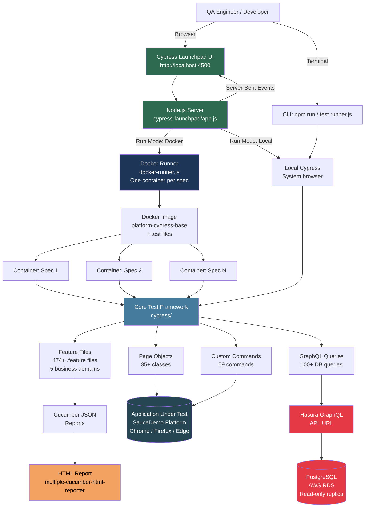

# 🚀 Cypress Launchpad Demo

A modern Cypress BDD (Cucumber) test automation framework featuring a custom **Launchpad UI** for managing test data and orchestrating parallel execution with Docker.

This project is designed to test [SauceDemo](https://www.saucedemo.com) and demonstrates advanced Cypress patterns, Docker integration, and real-time test monitoring.

---

## ✨ Key Features

- **🥒 BDD with Cucumber**: Write tests in plain English using Gherkin syntax.
- **🖥️ Launchpad UI**: A custom React-based dashboard (port 4500) to:
  - Manage environment-specific test data.
  - Select tests by `@tag` or specific feature files.
  - Toggle between Local, Docker, and Debug modes.
  - Monitor real-time logs via Server-Sent Events (SSE).
- **🐳 Docker Orchestration**: One-container-per-spec execution for maximum isolation and performance.
- **📊 Rich Reporting**: Automatically generates HTML reports with failure details and screenshots.
- **🏗️ Page Object Model**: Clean separation of logic and selectors for maintainability.

---

## 🏗️ Architecture



---

## 🛠️ Tech Stack

- **Cypress**: Core test runner.
- **cypress-cucumber-preprocessor**: For Gherkin support.
- **React**: Powers the Launchpad dashboard.
- **Node.js**: Backend server for the Launchpad and test orchestration.
- **Docker**: For parallelized, isolated test execution.

---

## 🚀 Getting Started

### 1. Prerequisites
- [Node.js](https://nodejs.org/) (v16+)
- [Docker Desktop](https://www.docker.com/products/docker-desktop/) (required for Docker run mode)

### 2. Installation
```bash
# Clone the repository
git clone <repository-url>
cd cypress-launchpad-demo

# Install dependencies
npm install
```

### 3. Launch the Dashboard
The easiest way to interact with the project is via the Launchpad UI:
```bash
npm run launch
```
Once started, open **[http://localhost:4500](http://localhost:4500)** in your browser.

---

## 📖 Running Tests

### Via Launchpad (Recommended)
1.  **Step 1 (Entities)**: Select your environment (e.g., `demo1`) and update test data if needed.
2.  **Step 2 (Features)**: Choose tests by tag (e.g., `@smoke`) or select individual `.feature` files.
3.  **Step 3 (Configure)**: Choose `local` or `docker` mode, select your browser, and set batch size.
4.  **Step 4 (Run)**: Hit "Start Run" and watch live logs.
5.  **Step 5 (Reports)**: View results in the "Reports" drawer.

### Via Command Line
```bash
# Run all tests headlessly
npm run cy:run

# Open Cypress Test Runner (Interactive)
npm run local
```

---

## 📂 Project Structure

```text
├── cypress/
│   ├── e2e/features/       # Gherkin feature files
│   ├── support/            # Custom commands and global hooks
│   │   └── step_definitions/ # Step implementation files
│   ├── pages/              # Page Object models
│   └── fixtures/           # Test data JSON files
├── cypress-launchpad/      # Launchpad UI and Backend logic
├── reports/                # Generated test reports
└── cypress.config.js       # Cypress configuration
```

---

## 🔧 Troubleshooting

### Missing Step Definitions
If you encounter a `Was unable to find step for...` error, ensure that the `stepDefinitions` path is correctly set in `package.json`:
```json
"cypress-cucumber-preprocessor": {
  "stepDefinitions": "cypress/support/step_definitions"
}
```

### Docker Issues
If Docker mode fails to start:
1. Ensure Docker Desktop is running.
2. Run `npm run launch` and check the "Docker Status" in the Configure step of the UI.
3. You may need to build the base image first (available via the UI).

---

## 📝 License
This project is for demonstration purposes. Developed for the Cypress Launchpad ecosystem.
