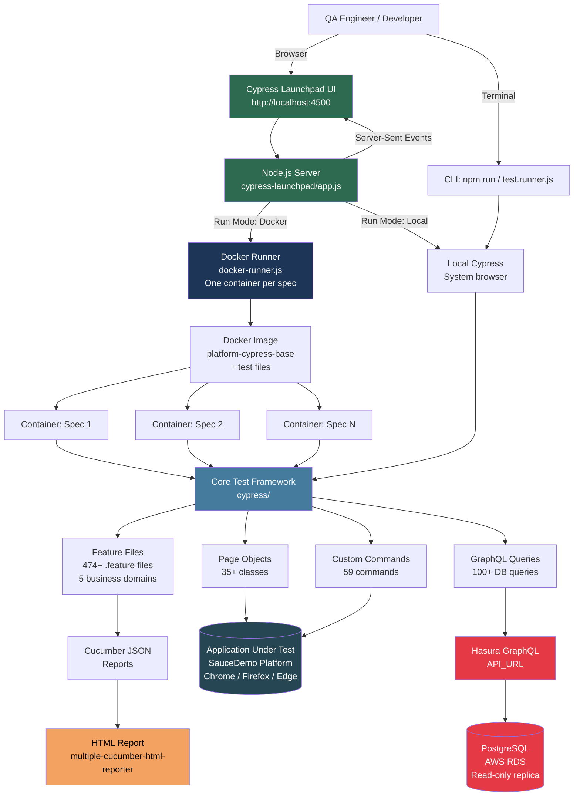
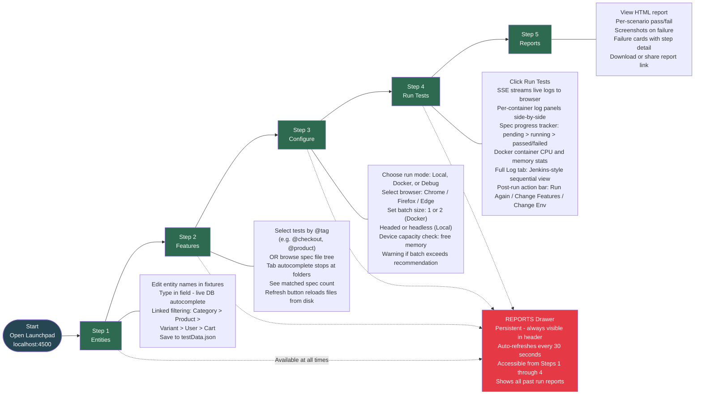
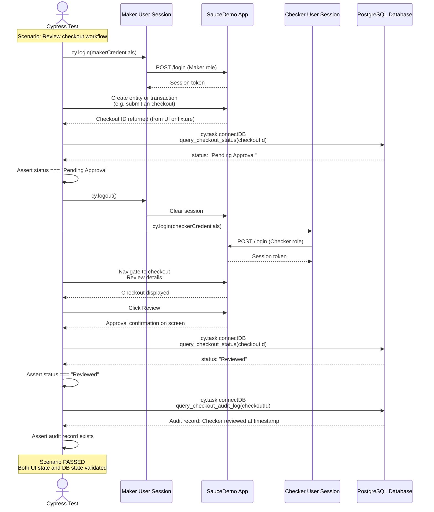
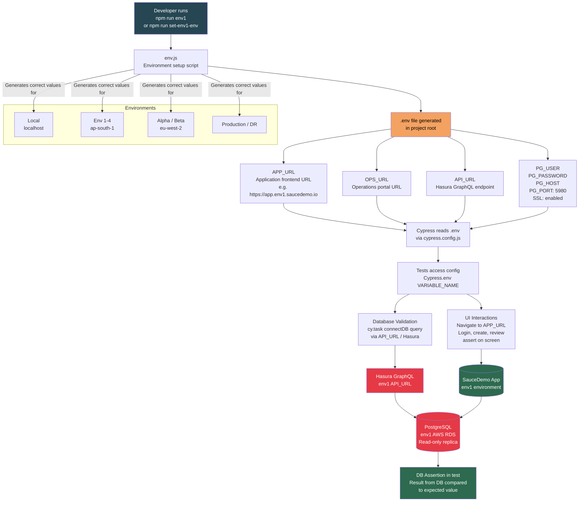
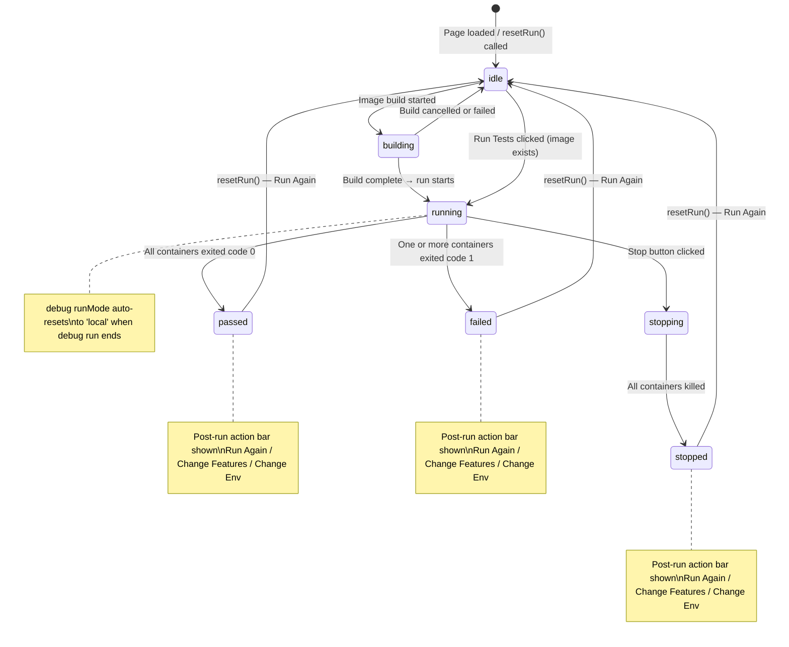
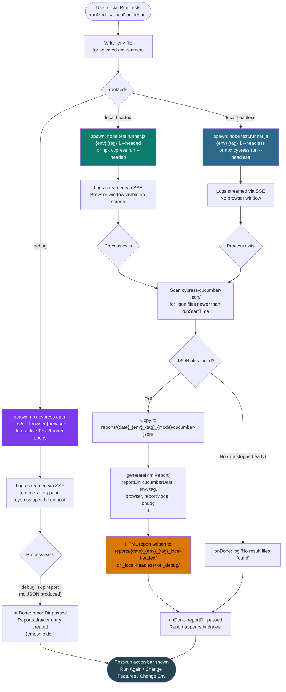

# SauceDemo Platform Cypress — System Flowcharts

**Version:** 1.2  
**Date:** 2026-04-17  
**Maintained by:** Ajay Chandru (testing@saucedemo.com)  
**Changes (2026-04-17):** Updated section 4 (Test Execution Inside Container) — `cypress.config.js` node now reflects correct cucumber preprocessor registration (`on('file:preprocessor', cucumberPlugin())`) after fixing the broken v4.3.1 plugin call  
**Changes (2026-04-15):** Added Run Status State Machine (section 9); updated 5-Step Journey with Refresh button + post-run action bar; updated Docker Lifecycle with stale image detection + local run report path; added local/debug execution flow (section 10); updated table of contents and diagram reference

This document contains all architectural and workflow diagrams for the SauceDemo Platform Cypress framework. Each diagram is accompanied by a brief explanation of what it represents and why it matters.

---

## Table of Contents

1. [High-Level System Architecture](#1-high-level-system-architecture)
2. [Cypress Launchpad — 5-Step User Journey](#2-cypress-launchpad--5-step-user-journey)
3. [Docker Execution Lifecycle](#3-docker-execution-lifecycle)
4. [Test Execution Flow Inside a Container](#4-test-execution-flow-inside-a-container)
5. [Test Data Management Flow](#5-test-data-management-flow)
6. [Parallel Execution Semaphore Model](#6-parallel-execution-semaphore-model)
7. [Multi-Role Test Approval Flow](#7-multi-role-test-approval-flow)
8. [Environment and Data Flow](#8-environment-and-data-flow)
9. [Run Status State Machine](#9-run-status-state-machine)
10. [Local and Debug Execution Flow](#10-local-and-debug-execution-flow)

---

## 1. High-Level System Architecture

This diagram shows every major component in the system and how they connect. The two entry points are the Launchpad UI (browser-based, guided) and the CLI (direct Cypress or `test.runner.js`). Both paths converge on the core test framework, which interacts with both the browser under test and the PostgreSQL database.



---

## 2. Cypress Launchpad — 5-Step User Journey

This diagram shows the full user journey through the Launchpad UI from start to report. Each step is a discrete phase with its own purpose. The Reports drawer is a persistent UI element accessible from any step — represented as a side branch that connects to all steps.



---

## 3. Docker Execution Lifecycle

This sequence diagram shows the complete lifecycle of a Docker-based test run from the moment the user clicks "Run Tests" through to the final HTML report. The semaphore pool controls concurrency — only `batchSize` containers run at the same time, so device resources are never overwhelmed. Stale image detection prevents confusing empty reports when spec files are newer than the built image.

```mermaid
sequenceDiagram
    actor User
    participant UI as Launchpad UI
    participant SRV as Node.js Server
    participant DOCK as Docker Engine
    participant CT as Container (per spec)
    participant RPT as Report System

    User->>UI: Click "Run Tests" (Docker mode)
    UI->>SRV: POST /api/run { tag, batchSize, browser }

    SRV->>DOCK: Check Docker daemon running
    DOCK-->>SRV: OK

    SRV->>DOCK: Check if image platform-cypress-base exists
    alt Image not found
        SRV->>DOCK: docker build -f Dockerfile.base (base image)
        DOCK-->>SRV: Streaming build logs
        SRV-->>UI: SSE: build log lines (real-time)
        DOCK-->>SRV: Base image ready
        SRV->>DOCK: docker build -f Dockerfile (runner image)
        DOCK-->>SRV: Runner image ready
    else Image exists
        SRV->>DOCK: Use existing image
    end

    SRV->>SRV: Resolve spec files from tag / selection
    SRV-->>UI: SSE: [docker] spec-manifest: 1:spec1,2:spec2,...N:specN
    Note over UI: Spec progress tracker shows all specs as PENDING

    loop Each spec (up to batchSize in parallel)
        SRV->>DOCK: docker create platform-cypress (container for spec N)
        DOCK-->>SRV: containerID

        SRV->>DOCK: docker cp .env containerID:/app/.env
        SRV->>DOCK: docker cp testData.json containerID:/app/testData.json

        SRV->>DOCK: docker start containerID
        Note over CT: Cypress runs inside container

        SRV->>DOCK: docker logs -f containerID (stream)
        DOCK-->>CT: (Cypress executing feature file)
        CT-->>SRV: Log lines with [spec-N | name] prefix (via handleLogLine)
        Note over SRV: handleLogLine strips ANSI and checks each line<br/>for "Can't run because no spec files"<br/>Sets specNotFoundInImage=true if detected
        SRV-->>UI: SSE: log lines (real-time)
        Note over UI: Per-container log panel updates live<br/>Spec N changes from PENDING to RUNNING

        SRV->>DOCK: docker wait containerID
        DOCK-->>SRV: exit code (0 = pass, 1 = fail)

        alt specNotFoundInImage detected
            SRV-->>UI: SSE: ⚠ SPEC NOT FOUND IN IMAGE — image is stale
            SRV-->>UI: SSE: ⚠ Rebuild required — go to Configure step → Rebuild Image
            Note over SRV: staleImageDetected=true for this run
        else spec found normally
            SRV->>DOCK: docker cp containerID:/app/cypress/cucumber-json reports/
            SRV-->>UI: SSE: [docker] Spec N | featureName — PASSED / FAILED
            Note over UI: Spec N status updated to PASSED or FAILED
        end

        SRV->>DOCK: docker rm containerID
    end

    alt staleImageDetected
        SRV-->>UI: SSE: ⚠ Skipping HTML report — rebuild image first
        Note over UI: Run ends in completed state; no report generated
    else all specs found
        SRV->>RPT: Merge all Cucumber JSON files
        RPT->>RPT: Generate HTML report (mode-aware metadata)
        RPT-->>SRV: Report path: reports/{date}_{env}_{tag}_docker/
    end

    SRV-->>UI: SSE: run-complete { reportPath }
    Note over UI: Post-run action bar appears:<br/>Run Again / Change Features / Change Environment
    Note over UI: Report appears in Reports drawer automatically
```

---

## 4. Test Execution Flow Inside a Container

This flowchart shows what happens inside a single Docker container (or local browser session) from the moment Cypress starts to the moment results are written. Every test follows this exact path through the framework layers.

```mermaid
flowchart TD
    A([Cypress Start<br/>Inside container or local]) --> B[Read .env file<br/>Load APP_URL, API_URL<br/>DB credentials, browser config]

    B --> C[Load cypress.config.js<br/>Register cucumber preprocessor:<br/>on('file:preprocessor', cucumberPlugin())<br/>Set timeouts: 60s default<br/>return config]

    C --> D[Read testData.json fixture<br/>Category, Product, Variant<br/>User, Cart names]

    D --> E[Locate .feature file<br/>Specified by --spec flag]

    E --> F[Cucumber Preprocessor<br/>Parse Gherkin syntax<br/>Match tags and scenarios]

    F --> G{Scenario type}

    G -->|Scenario| H[Single test run]
    G -->|Scenario Outline| I[Run once per example row]

    H --> J[Step Definition file<br/>.cy.js files]
    I --> J

    J --> K{Step type}

    K -->|UI Interaction| L[Page Object method<br/>35+ page classes]
    K -->|Database Check| M[GraphQL Query<br/>query.js functions]
    K -->|Common Action| N[Custom Command<br/>commands.js - 59 commands]

    L --> O[Cypress Browser Commands<br/>cy.get, cy.click, cy.type<br/>cy.contains, cy.should]
    N --> O

    O --> P[(Application Under Test<br/>SauceDemo Platform)]

    M --> Q[cy.task connectDB<br/>Hasura GraphQL request]
    Q --> R[(PostgreSQL<br/>AWS RDS)]
    R --> S[DB Assertion<br/>expect result to equal<br/>expected value]

    P --> T{Assertion result}
    S --> T

    T -->|Pass| U[Next step in scenario]
    T -->|Fail| V[Screenshot captured<br/>cypress/screenshots/]

    U --> W{More steps?}
    W -->|Yes| K
    W -->|No - Passed| X[Scenario: PASSED<br/>Write to Cucumber JSON]

    V --> X2[Scenario: FAILED<br/>Write to Cucumber JSON<br/>Attach screenshot]

    X --> Y{More scenarios?}
    X2 --> Y

    Y -->|Yes| F
    Y -->|No| Z([Cypress Exits<br/>Cucumber JSON written<br/>Exit code: 0 or 1])

    style A fill:#264653,color:#fff
    style Z fill:#264653,color:#fff
    style P fill:#2d6a4f,color:#fff
    style R fill:#e63946,color:#fff
    style V fill:#e63946,color:#fff
    style X fill:#2d6a4f,color:#fff
    style X2 fill:#e63946,color:#fff
```

---

## 5. Test Data Management Flow

This diagram shows how entity names flow from a live PostgreSQL database through the Launchpad UI into the test fixture files that Cypress reads at runtime. The linked filtering ensures that all related entities (Category, Product, Variant, User, Cart) are always consistent with each other before a test run.

```mermaid
graph LR
    QA[QA Engineer<br/>Opens Launchpad<br/>Step 1: Entities] --> INPUT[Types entity name<br/>in search field]

    INPUT -->|Debounced HTTP request| API[Node.js Server<br/>GET /api/autocomplete]

    API --> PG[(PostgreSQL<br/>AWS RDS<br/>Live environment data)]

    PG -->|Query results| API
    API -->|JSON suggestions| UI_AC[Autocomplete dropdown<br/>Shows matching entity names<br/>from actual DB]

    UI_AC --> SEL[User selects a value]

    SEL --> LF[Linked Entity Filter]

    LF --> P[Category selected]
    P -->|Filters available options| F[Product<br/>amex to Category's products]
    F -->|Filters available options| AG[Variant<br/>amex to Product's variants]
    AG -->|Filters available options| CL[User<br/>standalone]
    CL -->|Filters available options| CO[Cart<br/>amex to User's carts]

    CO --> SAVE[User clicks Save]

    SAVE --> JSON[testData/envNTestData.json<br/>Updated with selected<br/>entity names]

    JSON -->|docker cp at run time| CT[Docker Container<br/>or Local Cypress]

    CT -->|cy.fixture| TEST[Test reads entity name<br/>from fixture<br/>Uses in Gherkin step]

    style QA fill:#264653,color:#fff
    style PG fill:#e63946,color:#fff
    style JSON fill:#f4a261,color:#000
    style TEST fill:#2d6a4f,color:#fff
    style LF fill:#1d3557,color:#fff
```



---

## 6. Parallel Execution Semaphore Model

This diagram shows how the batch semaphore controls concurrent container execution. The semaphore ensures that no more than `batchSize` containers run simultaneously regardless of how many total specs are in the run, protecting device memory and CPU from overload.

```mermaid
graph TD
    START([Run triggered<br/>N specs resolved]) --> SM[Semaphore Pool<br/>max slots = batchSize<br/>1 or 2 based on device capacity]

    SM --> Q{Specs remaining<br/>in queue?}

    Q -->|Yes + slot available| ACQUIRE[Acquire semaphore slot]
    Q -->|No + all slots idle| DONE([All specs complete<br/>Proceed to merge])

    ACQUIRE --> PICK[Pick next spec from queue]

    PICK --> C1[docker create<br/>from platform-cypress image]
    C1 --> C2[docker cp .env<br/>inject environment config]
    C2 --> C3[docker cp testData.json 
    inject entity names]
    C3 --> C4[docker start<br/>begin test execution]
    C4 --> C5[docker logs -f<br/>stream to UI via SSE]
    C5 --> C6[docker wait<br/>block until exit]

    C6 --> RESULT{Exit code}

    RESULT -->|0 - Pass| PASS[Mark spec PASSED<br/>Extract JSON report]
    RESULT -->|non-zero - Fail| FAIL[Mark spec FAILED<br/>Extract JSON report + screenshots]

    PASS --> CLEANUP[docker rm<br/>free container resources]
    FAIL --> CLEANUP

    CLEANUP --> RELEASE[Release semaphore slot]
    RELEASE --> Q

    DONE --> STALE{staleImageDetected?}
    STALE -->|Yes| WARN[Emit ⚠ Skipping HTML report<br/>Direct user to Rebuild Image]
    STALE -->|No| MERGE[Merge all Cucumber JSON files<br/>from all containers]
    MERGE --> HTML[Generate HTML report<br/>reports/{date}_{env}_{tag}_docker/]
    WARN --> NOTIFY[Notify UI via SSE: run-complete]
    HTML --> NOTIFY
    NOTIFY --> END([Post-run action bar appears<br/>Run Again / Change Features / Change Env<br/>Report in drawer if generated])

    style START fill:#264653,color:#fff
    style SM fill:#1d3557,color:#fff
    style PASS fill:#2d6a4f,color:#fff
    style FAIL fill:#e63946,color:#fff
    style HTML fill:#f4a261,color:#000
    style END fill:#264653,color:#fff
    style DONE fill:#2d6a4f,color:#fff
```

---

## 7. Multi-Role Test Approval Flow

This sequence diagram shows the Maker-Checker approval pattern that is the foundation of financial workflow testing on this platform. A single Cypress test scenario can span multiple user sessions — logging in as one role, performing an action, logging in as another, and validating the final state in the database.



---

## 8. Environment and Data Flow

This diagram shows how a single command sets the active environment, how `env.js` generates the configuration file, and how that configuration flows through Cypress into every test and database query. All 8 environments follow the same pattern — only the generated `.env` values differ.



---

## 9. Run Status State Machine

This state machine shows every possible value of `runStatus` in the React UI and how it transitions. Understanding this is essential when reading `app.js` — many UI elements render conditionally based on this value. The post-run action bar (Run Again / Change Features / Change Environment) appears in the three terminal states.



---

## 10. Local and Debug Execution Flow

This flowchart shows what happens when the user runs tests in Local mode or Debug mode. Unlike Docker mode (which produces container-per-spec parallel execution), local and debug runs spawn a single `node` or `npx` child process directly on the host machine. Local runs now produce HTML reports in the same `reports/` folder as Docker runs.



---

## Diagram Reference

| # | Diagram | Type | Key Insight |
|---|---|---|---|
| 1 | High-Level System Architecture | graph TD | Full component map — how Launchpad, Docker, Cypress, and DB connect |
| 2 | Launchpad 5-Step User Journey | graph LR | User workflow from entity setup to reports (with Refresh button + post-run actions) |
| 3 | Docker Execution Lifecycle | sequenceDiagram | Container lifecycle: create, inject, run, stream, stale detection, extract, clean up |
| 4 | Test Execution Inside Container | flowchart TD | Framework layers: Gherkin → Step Def → Page Object → Browser + DB |
| 5 | Test Data Management Flow | graph LR | How DB autocomplete feeds entity names into test fixtures |
| 6 | Parallel Execution Semaphore Model | graph TD | How batch size limits concurrency; stale detection skips report when image is outdated |
| 7 | Multi-Role Approval Flow | sequenceDiagram | Maker/Checker pattern — two user sessions, UI + DB validation |
| 8 | Environment and Data Flow | graph TD | How one command configures the full stack for a target environment |
| 9 | Run Status State Machine | stateDiagram-v2 | All runStatus values and transitions including post-run action bar states |
| 10 | Local and Debug Execution Flow | flowchart TD | How local/debug runs spawn processes, collect JSON, and generate mode-aware HTML reports |

---

*Maintained by Ajay Chandru — testing@saucedemo.com*
