# Cypress Launchpad — Knowledge Transfer Document

**Session Type:** Application KT (Knowledge Transfer)<br/>
**Audience:** Manual Testers · Automation Testers · Developers · DevOps<br/>
**Application:** Cypress Launchpad (`cypress-launchpad/`)<br/>
**URL:** `http://localhost:4500`<br/>
**Last Updated:** 2026-04-23

---

## Audience Guide

This document is written for four different audiences. Use the table below to find what is most relevant to you.

| Section | Manual Tester | Automation Tester | Developer | DevOps |
|---|:---:|:---:|:---:|:---:|
| 1. What Is the Launchpad | Must read | Must read | Must read | Must read |
| 2. How to Start | Must read | Must read | Must read | Must read |
| 3. Header Bar | Must read | Must read | Must read | Must read |
| 4. Step 1 — Entities | Must read | Must read | Skim | Skip |
| 5. Step 2 — Features | Must read | Must read | Skim | Skip |
| 6. Step 3 — Configure | Must read | Must read | Must read | Must read |
| 7. Step 4 — Run Tests | Must read | Must read | Must read | Must read |
| 8. Step 5 — Reports | Must read | Must read | Skim | Skim |
| 9. Reports Drawer | Must read | Must read | Must read | Skim |
| 10. Docker Architecture | Skim | Must read | Must read | Must read |
| 11. SSE Log Streaming | Skip | Must read | Must read | Must read |
| 12. Two-Layer Image Design | Skip | Skim | Must read | Must read |
| 13. Cross-Platform Notes | Skim | Skim | Must read | Must read |
| 14. File Structure | Skip | Skim | Must read | Must read |
| 15. API Reference | Skip | Skim | Must read | Must read |
| 16. Troubleshooting | Must read | Must read | Must read | Must read |

---

## Table of Contents

1. [What Is the Launchpad?](#1-what-is-the-launchpad)
2. [How to Start](#2-how-to-start)
3. [Header Bar](#3-header-bar)
4. [Step 1 — Entities (Test Data Management)](#4-step-1--entities-test-data-management)
5. [Step 2 — Features (Test Selection)](#5-step-2--features-test-selection)
6. [Step 3 — Configure (Run Settings)](#6-step-3--configure-run-settings)
7. [Step 4 — Run Tests (Live Execution)](#7-step-4--run-tests-live-execution)
8. [Step 5 — Reports](#8-step-5--reports)
9. [Persistent Reports Drawer](#9-persistent-reports-drawer)
10. [Docker Architecture](#10-docker-architecture)
11. [SSE Log Streaming](#11-sse-log-streaming)
12. [Two-Layer Docker Image Design](#12-two-layer-docker-image-design)
13. [Cross-Platform Notes](#13-cross-platform-notes)
14. [File Structure](#14-file-structure)
15. [API Reference](#15-api-reference)
16. [Troubleshooting](#16-troubleshooting)

---

## 1. What Is the Launchpad?

The **Cypress Launchpad** is a browser-based control panel for the SauceDemo test automation framework. It is a self-contained web application that runs locally at `http://localhost:4500`.

It gives every team member — regardless of technical background — a single interface to:

- Manage test data (entity names) without editing JSON files by hand
- Select which tests to run using tags or file browsing
- Configure how tests run (local browser or Docker containers)
- Watch tests execute in real time with live streaming logs
- Review HTML reports and failure details

### The Big Picture

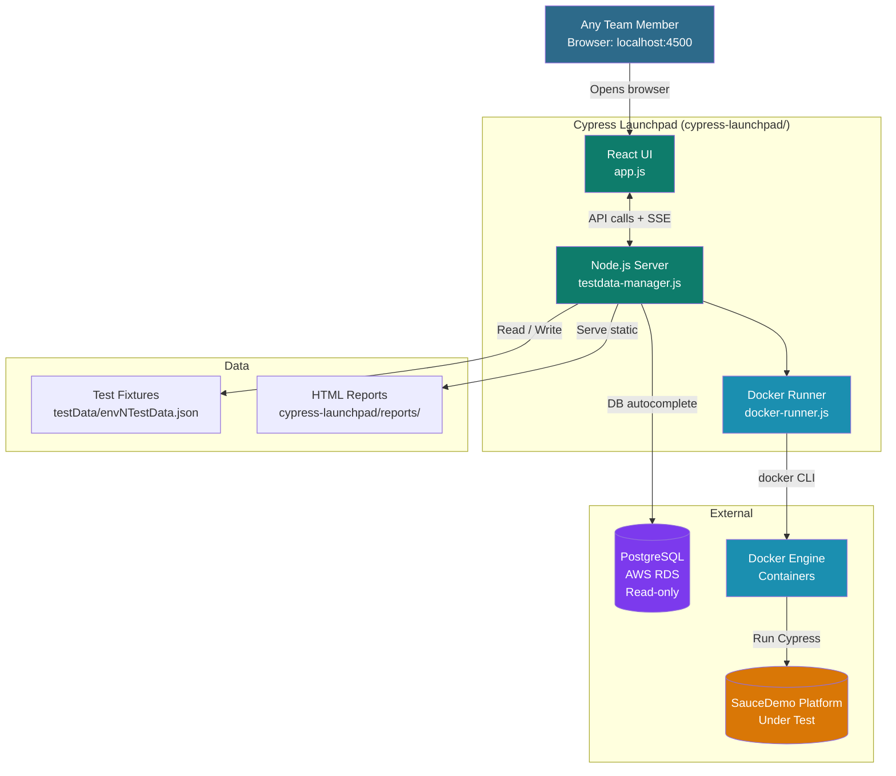

---

## 2. How to Start

### Option A — Automatic (with Cypress UI)

```bash
npm run env3
```

This single command starts two services simultaneously:
- **Cypress UI** — opens the Cypress test runner
- **Cypress Launchpad** — starts at `http://localhost:4500`

Open `http://localhost:4500` in your browser.

### Option B — Standalone (Launchpad only)

```bash
node cypress-launchpad/testdata-manager.js
```

Then open `http://localhost:4500`.

### To Stop the Launchpad

Click the **KILL** button in the top-right header, or press `Ctrl+C` in the terminal where it is running.

---

## 3. Header Bar

The header is always visible at the top of every screen.

```
+-------------------------------------------------------------------------------------------+
|  Cypress Launchpad  [Tour]  |  env/ env3  |  [CYPRESS •]  [DEBUG]  [⚑ REPORTS 12]  [⏻ KILL]  |
+-------------------------------------------------------------------------------------------+
```

| Element | What It Does |
|---|---|
| **env/ env3** | Shows the currently selected environment. Updates when you change environment in Step 1. |
| **CYPRESS •** | Green pulsing dot confirms the Launchpad server is running. |
| **DEBUG** | Opens `cypress open` (interactive Test Runner) for the selected environment. Navigates to Step 4. Shows "■ STOP DEBUG" (orange) while running. Disabled until an environment is selected. Feature selection in Step 2 is optional when using Debug mode. Debug `runMode` auto-resets to `'local'` after the debug session ends. |
| **⚑ REPORTS 12** | Opens the persistent Reports drawer. The number badge shows total saved reports. Click from any step without losing your place. |
| **⏻ KILL** | Shuts down the Launchpad server on port 4500. Asks for confirmation first. |
| **Tour** | Starts a guided walkthrough highlighting key UI elements step by step. |

---

## 4. Step 1 — Entities (Test Data Management)

### What This Step Does

Cypress tests read entity names (user accounts, product names, categories, etc.) from a JSON fixture file at runtime:

```
cypress/fixtures/testData/{env}TestData.json
```

If the entity name in the fixture does not match a real entity in the database, the test fails immediately. Step 1 lets you update these names using a form with live database autocomplete, so you always have valid names before running.

### Data Flow

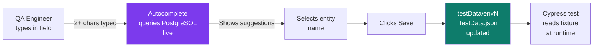

### UI Layout

The form has **4 data cards** and **2 tabs**:

| Tab | Purpose |
|---|---|
| **Existing Entities** | Entity names already configured and working in the environment |
| **New Entities** | Slot to configure a new set of entity names for testing new data |

| Card | Fields |
|---|---|
| **User Accounts** | Admin Users, Standard Users, Guest Users, Locked Users |
| **Product Catalog** | Featured Products, Sale Products, New Arrivals, Budget Items |
| **Checkout Details** | First Name, Last Name, Postal Code |
| **API Configuration** | Base URL, API Key |

### Linked Entity Filtering

Selecting a parent entity automatically narrows the options in dependent fields. This prevents you from accidentally pairing a user with an variant it does not belong to.

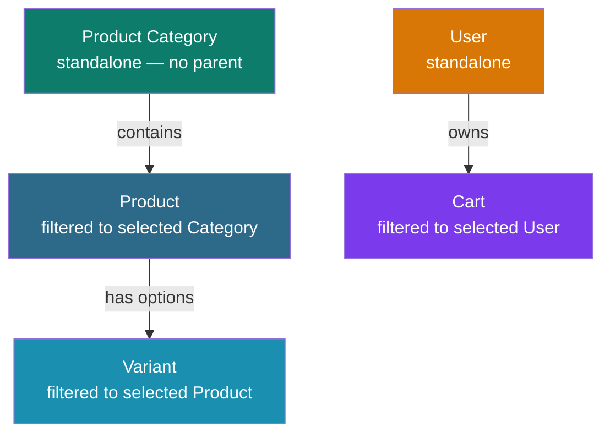

### How to Use

1. Select environment from dropdown
2. Click **Load Data** — current fixture values populate the form
3. Type in any field (minimum 2 characters) to trigger autocomplete
4. Select a value from the dropdown
5. Click **Save to TestData** — writes to the fixture file immediately

---

## 5. Step 2 — Features (Test Selection)

### What This Step Does

Choose which feature files (test specs) to run. Two modes are available.

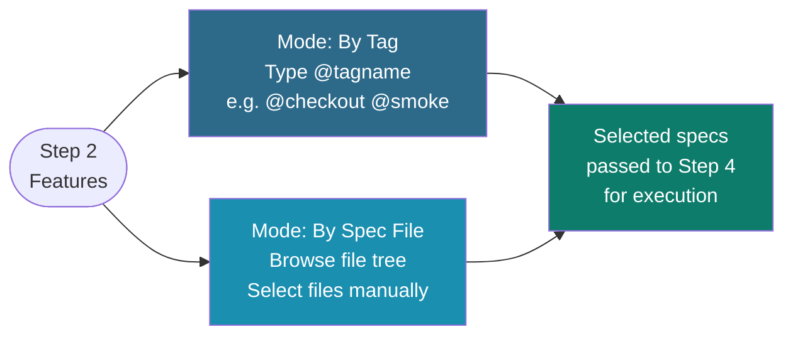

### Mode 1 — By Tag

Type a tag and the Launchpad counts all matching scenarios across all 474+ feature files.

```
Type: @checkout
Launchpad scans all .feature files
Shows: 12 spec files matched · 47 scenarios total
```

Common tags in this project:

| Tag | What It Runs |
|---|---|
| `@smoke` | Core critical path tests |
| `@checkout` | All checkout scenarios |
| `@product` | All product scenarios |
| `@user` | Entity onboarding tests |
| `@payment` | Payment processing tests |
| `@add` | Create workflow scenarios only |
| `@review` | Review workflow scenarios only |

### Mode 2 — By Spec File (Tree Browser)

Browse the complete feature file tree. Select individual `.feature` files by clicking checkboxes.

**Tab Autocomplete** — when typing a path in the search box, press Tab to autocomplete. Autocomplete stops at folder boundaries so you can navigate level by level:

```
Type: product/temp     → press Tab
→ product/temporaryOrder/

Press Tab again
→ product/temporaryOrder/VISA/

Press Tab again
→ product/temporaryOrder/VISA/solo/
```

### Refresh Button

The **Refresh** button (right-aligned in the Step 2 header) reloads feature files and tags from disk without navigating away from the step. Use this after adding new `.feature` files mid-session so they appear in the tree and tag counts without restarting the Launchpad.

```
Select Features to Run                                      [↻ Refresh]
```

While loading, the button shows "Refreshing..." and is disabled. The full tag list and file tree are re-fetched from disk on click.

---

## 6. Step 3 — Configure (Run Settings)

### What This Step Does

Choose how the selected tests will run before clicking Start.

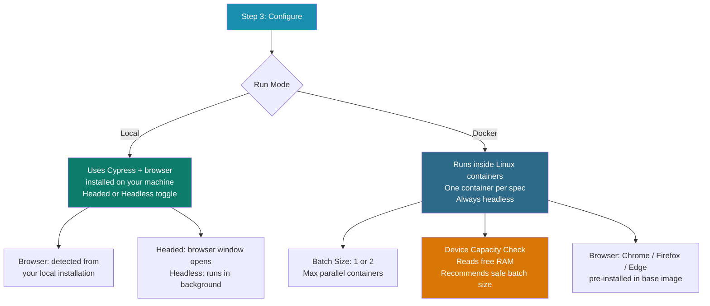

### Run Modes Compared

| Feature | Local Mode | Docker Mode | Debug Mode |
|---|---|---|---|
| Environment | Your machine | Clean Linux container | Your machine |
| Browser support | What you have installed | Chrome, Firefox, Edge | What you have installed |
| Headed option | Yes (toggle) | No (always headless) | Always headed (cypress open) |
| Parallel execution | No | Yes (batch 1 or 2) | No |
| Test isolation | Shared state between runs | Fully isolated per container | Shared state |
| First-run setup | Just Cypress installed | Docker must be running | Just Cypress installed |
| Feature selection | Required | Required | Optional |
| Activated via | Run Mode card | Run Mode card | DEBUG button in header |
| Best for | Headless regression | Clean parallel regression | Exploring specs, time-travel debugging |

> **Note:** Debug mode activates `cypress open` — the interactive Test Runner with command log and time-travel snapshots. Feature selection is optional; you can search and run any spec from within the Cypress UI itself.

### Device Capacity Detection (Docker mode only)

When Docker mode is selected, the Launchpad reads your device's RAM and recommends a safe batch size. This prevents out-of-memory crashes.

```
Device Capacity
  Total RAM:   16 GB
  Free RAM:     9 GB
  Recommended: Batch Size 2

  Warning: Selected batch size 2 may exceed device capacity  ← shown if over recommendation
```

Recommendation logic:

| Free RAM | Recommended Batch Size |
|---|---|
| More than 8 GB | 2 |
| 8 GB or less | 1 |

Maximum batch size is **2**. Each container uses approximately 4 GB of RAM.

---

## 7. Step 4 — Run Tests (Live Execution)

This is the most feature-rich step. Everything that happens during a test run is visible here in real time.

### Full Run Flow

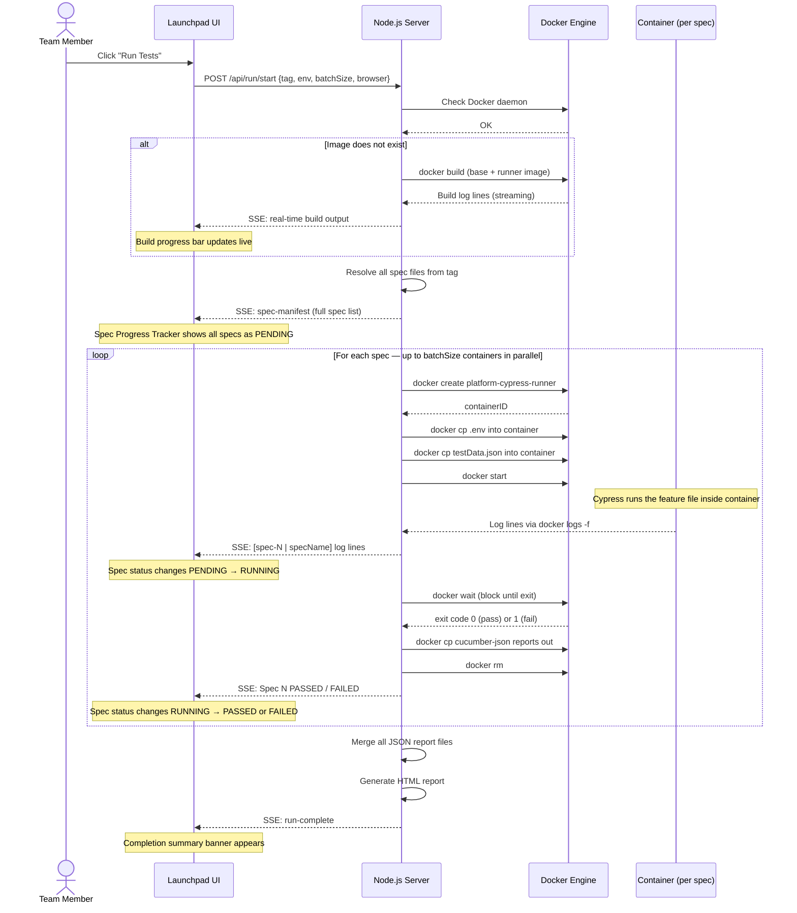

### 7.1 Sticky Status Bar

As soon as a run starts, a sticky bar appears at the top of the page and stays visible as you scroll.

```
● RUNNING  |  env3  🐳 Docker · Chrome · Batch 2  |  ⏱ 01:34  |  [■ STOP]
████████████████░░░░░░░░░░  6 / 9 specs complete
```

| Element | Meaning |
|---|---|
| Coloured dot | Amber = running, Green = passed, Red = failed |
| Status label | RUNNING / STOPPING / PASSED / FAILED / STOPPED |
| Environment badge | Amber pill showing selected environment |
| Run info | Mode, browser, batch size |
| Timer | Elapsed time counting up from run start |
| Progress bar | Fills left to right as specs complete |
| STOP button | Kills all active containers immediately |

### 7.2 Spec Progress Tracker

Shows every spec in the run with a live status badge. Appears as soon as the spec manifest is received — all specs are visible as PENDING before any container starts.

```
Spec Progress                              9 total  ▶ 2 running  ⏳ 1 pending  ✓ 5 passed
─────────────────────────────────────────────────────────────────────────────────
✓  Spec 1   addProductToCart                        PASSED
✗  Spec 2   checkoutWithEmptyCart                   FAILED    ← red background row
▶  Spec 3   removeProductFromCart                   RUNNING   ← amber background row
▶  Spec 4   loginWithLockedUser                     RUNNING
⏳  Spec 5   completeCheckoutFlow                    PENDING
```

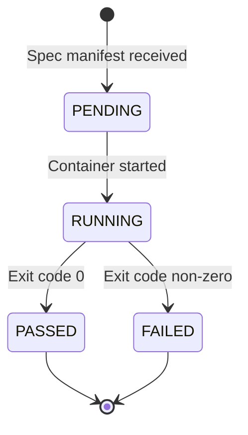

### 7.3 Container Stats

While containers are running, CPU and memory usage is displayed per container with colour-coded progress bars.

```
Spec 3 · removeProductFromCart      ⚡ ████████░░░░  67%    💾 ████░░░░  1.8 / 4.0 GB
Spec 4 · loginWithLockedUser        ⚡ ████████████░  94%   💾 █████░░░  2.1 / 4.0 GB
```

Bar colours:
- CPU 0–70% → Green
- CPU 70–90% → Amber
- CPU 90%+ → Red (container is under heavy load)
- Memory 0–65% → Blue
- Memory 65–85% → Amber
- Memory 85%+ → Red

### 7.4 Split Log Viewer

Log output from running containers appears in side-by-side panels. Layout adapts to batch size:
- Batch size 1 → single full-width panel
- Batch size 2 → two panels side by side

```
┌─────────────────────────────────────────┬─────────────────────────────────────────┐
│  Spec 3 | removeProductFromCart     [Copy]  │  Spec 4 | loginWithLockedUser      [Copy]  │
├─────────────────────────────────────────┼─────────────────────────────────────────┤
│  Running: cypress/e2e/features/...      │  Running: cypress/e2e/features/...      │
│  ✓ Given active products exist (112ms)  │  ✓ Given users exist (98ms)             │
│  ✓ When I navigate to cart (88ms)       │  → When I fill in login form...         │
│  ✗ AssertionError: expected '0'         │                                         │
│    to equal '1'                         │  Starting container...                  │
└─────────────────────────────────────────┴─────────────────────────────────────────┘
```

**Log line colour coding:**

| Line type | Colour | Example |
|---|---|---|
| Passing step | Green text, green left border | `✓ When I click review (203ms)` |
| Failing step / Error | Red background, red left border, light red text | `✗ AssertionError: expected...` |
| Warning / Deprecated | Orange background, orange left border | `⚠ warn: allowCypressEnv is enabled` |
| Docker system line | Cyan text | `[docker] Found 9 specs. Running up to 2 in parallel.` |
| Default output | Grey text | All other Cypress output |

### 7.5 Log Filter Bar

```
[ All ]  [ Full Log ]          🔍 Search logs...          [⇩ Auto-scroll ON]
```

| Control | What It Does |
|---|---|
| **All** | Shows every log line — default; shows the SplitLogViewer (per-container panels) |
| **Full Log** | Switches to FullLogViewer — Jenkins-style sequential view of all containers in spec-number order with section headers, search, and Copy All |
| **Search box** | Free-text filter across all log lines |
| **⇩ Auto-scroll ON/OFF** | Toggles auto-scroll for all log panels. ON = panels scroll to latest line. OFF = panels stay at their current scroll position. Useful when reviewing earlier logs while a run is still in progress. |

> **Note:** The Errors and Warnings filter tabs were removed in April 2026. FullLogViewer with its search box replaces them — search for "Error" or "AssertionError" to filter failure lines.

### 7.6 Copy Logs Button

Each log panel has a **Copy** button in the header. Clicking it:
1. Strips all ANSI escape codes from every line
2. Copies clean plain text to the clipboard
3. Changes the button label to **Copied!** for 1.5 seconds

This is important because raw Docker logs contain colour escape sequences like `\x1b[35m` which are unreadable if pasted into a ticket or email.

### 7.7 Post-Run Action Bar

When a run ends (passed, failed, or stopped), a quick-action bar appears immediately below the status bar:

```
┌─────────────────────────────────────────────────────────────────────┐
│  [↺ Run Again]   [⊘ Change Features]   [⬡ Change Environment]      │
└─────────────────────────────────────────────────────────────────────┘
```

| Button | Action |
|---|---|
| **↺ Run Again** | Resets all run state and re-runs the same tag, specs, environment, and mode |
| **⊘ Change Features** | Resets run state and navigates back to Step 2 (feature selection) |
| **⬡ Change Environment** | Resets run state and navigates back to Step 1 (entity and environment selection) |

Navigating back via the step indicator or back button while a run is complete also clears run state cleanly (no stale logs or status carried forward).

---

## 8. Step 5 — Reports

After a run completes, all reports are saved to a timestamped folder inside `cypress-launchpad/reports/`. This applies to **all run modes** — Docker, local headed, local headless, and debug.

```
cypress-launchpad/reports/{YYYY-MM-DD_HH-MM}_{env}_{tag}_{mode}/
    html/
        index.html      ← open this in browser
    cucumber-json/      ← raw JSON source (Docker: extracted from containers; Local: copied from cypress/cucumber-json/)
    screenshots/        ← failure screenshots
    live/               ← live screenshots captured during run (Docker only)
    run.log             ← full run log (Docker only) — all SSE lines from the run
```

The Reports step lists all saved runs. For each report you can:

| Action | What It Does |
|---|---|
| Open HTML Report | Opens the full `multiple-cucumber-html-reporter` HTML report in a new tab |
| View Logs | Opens a full-screen overlay showing the saved `run.log` with search and Copy All (Docker runs only; appears only when `run.log` exists) |
| Delete | Removes the report directory to free disk space |

> **Note:** The "View Failures" button was removed in April 2026. Use the HTML report for full failure details, or "View Logs" to search the raw run log.

### Report Naming Convention

```
2026-04-15_14-32_env3_checkout_docker
   │           │      │      │      └── run mode: docker / local-headed / local-headless / debug
   │           │      │      └───────── tag or "custom" for file-based runs
   │           │      └──────────────── environment
   │           └─────────────────────── time (HH-MM)
   └─────────────────────────────────── date (YYYY-MM-DD)
```

### Local Run Reports

Local and debug runs now produce reports in the same `reports/` folder as Docker runs. The Launchpad:
1. Creates the report folder when the run starts
2. On process exit, scans `cypress/cucumber-json/` for `.json` files newer than the run start time
3. Copies those files to the report folder and generates an HTML report
4. Passes the `reportDir` to the UI so the report appears in the Reports drawer automatically

Debug runs (`cypress open`) produce no Cucumber JSON, so the report folder is created but HTML generation is skipped.

---

## 9. Persistent Reports Drawer

The **⚑ REPORTS** button in the header opens a side drawer that slides in from the right edge of the screen. It is accessible from **any step** — you never need to navigate to Step 5.

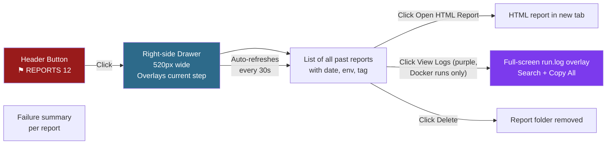

**Auto-refresh:** While the drawer is open, it fetches the latest report list every 30 seconds. If a run completes in the background while you are looking at an earlier report, the new entry appears automatically.

**View Logs button** (purple): Appears on a report card only when a `run.log` file exists for that run (Docker runs only). Opens a full-screen overlay (96vw × 92vh) showing all log lines grouped by spec section — the same visual structure as the FullLogViewer. Supports free-text search and Copy All.

---

## 10. Docker Architecture

This section explains what actually happens when you run tests in Docker mode.

### Why Docker?

Running Cypress directly on your machine means:
- Tests share browser state between runs
- Results vary between Windows, Mac, and Linux machines
- Running two specs at the same time can cause test collisions

Running inside Docker means:
- Every container starts from an identical clean Linux environment
- Each spec file gets its own completely isolated container
- No state leaks between specs
- The same result on every machine

### One Container Per Spec

This is the core architectural decision. The Launchpad runs **one Docker container for every spec file**.

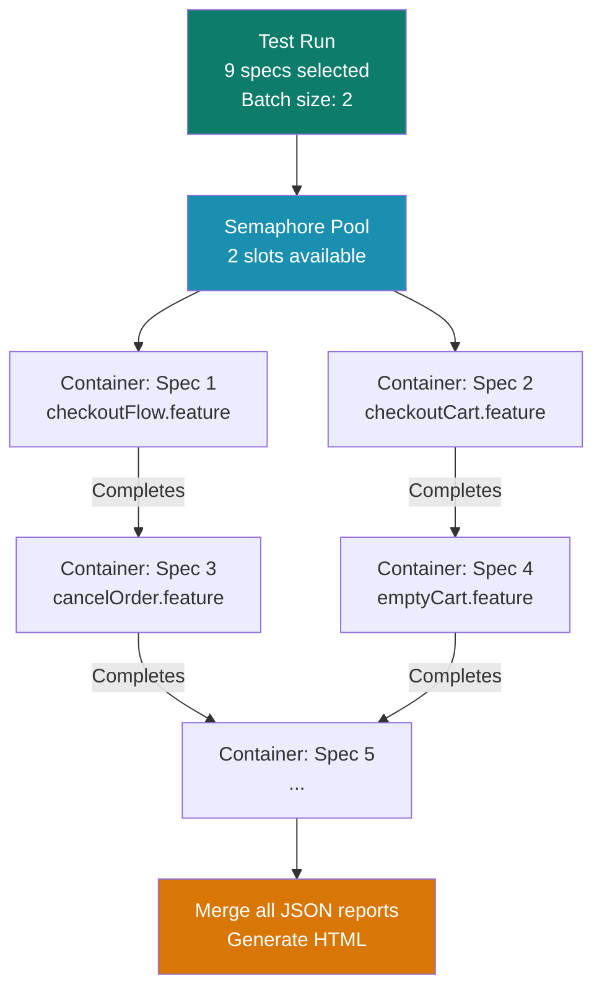

When a container finishes, it frees a slot in the semaphore pool and the next spec in the queue starts. This continues until all specs are done, then all JSON reports are merged into a single HTML report.

### Container Lifecycle (per spec)

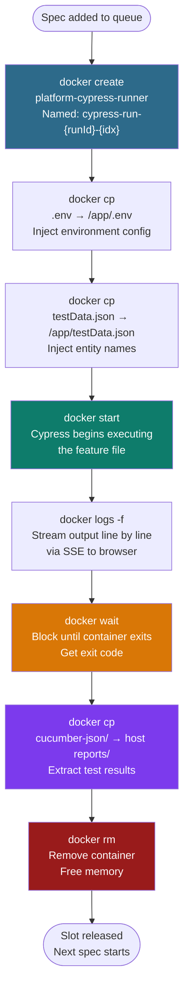

---

## 11. SSE Log Streaming

SSE stands for **Server-Sent Events**. It is the technology that makes logs appear in the browser in real time.

### How It Works

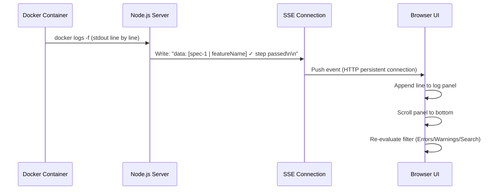

### Why SSE Instead of WebSocket?

| Feature | SSE | WebSocket |
|---|---|---|
| Direction | Server → Browser only | Both directions |
| Setup complexity | One HTTP endpoint | Separate protocol handshake |
| Browser reconnect | Automatic | Manual |
| Suitability for log streaming | Perfect | Overkill |

Log streaming is one-directional (server to browser), so SSE is the right tool. No external library is needed — it is built into every browser and Node.js.

### SSE Endpoint

```
GET /api/run/logs/:runId
Content-Type: text/event-stream
```

Each event is a plain text line prefixed with the spec label:

```
data: [spec-1 | checkoutWithEmptyCart] ✓ When I click checkout (203ms)
data: [docker] Spec 2 | cart — ✗ FAILED
data: [docker] spec-manifest: 1:addProductToCart,2:checkoutWithEmptyCart,3:removeProduct
```

---

## 12. Two-Layer Docker Image Design

Building a Docker image from scratch takes 3-5 minutes because it installs all npm packages. To avoid this delay on every run, the image is split into two layers.

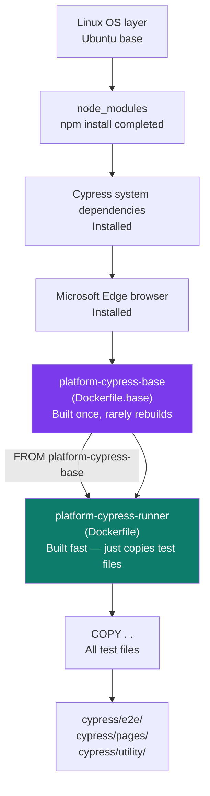

| Image | When to Rebuild | Time |
|---|---|---|
| Base (`platform-cypress-base`) | Only after `package.json` changes | 3-5 minutes |
| Runner (`platform-cypress-runner`) | After any test file change (click **Rebuild Image**) | 10-20 seconds |

**Rebuild Image** = fast rebuild (copies new test files onto existing base)
**Full Rebuild (npm install)** = slow rebuild (rebuilds base image with fresh `npm install`)

Use **Full Rebuild** only when you add or update npm packages.

---

## 13. Cross-Platform Notes

The Launchpad runs on Windows, Mac, and Linux with no code changes needed. Platform-specific behaviour is handled automatically.

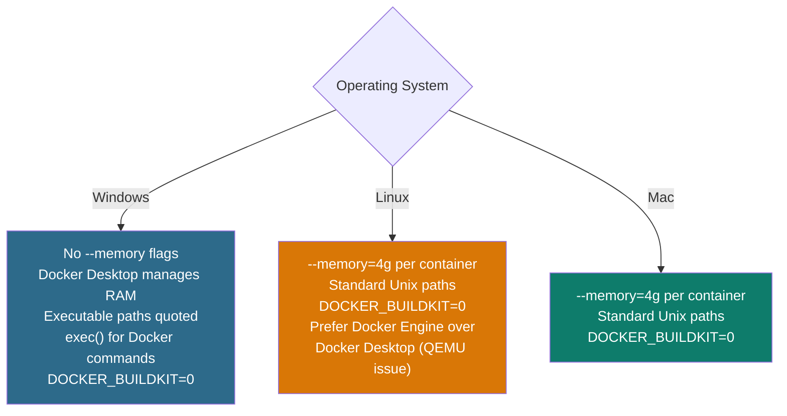

### Linux Docker Engine vs Docker Desktop

On Linux, Docker Desktop runs inside a QEMU virtual machine. Under parallel container load, the QEMU VM can be killed by the Linux OOM killer, causing the entire run to crash silently.

Use **Docker Engine** instead:

```bash
sudo apt remove docker-desktop
sudo apt install -y docker.io
sudo usermod -aG docker $USER
sudo systemctl enable --now docker
```

Same `docker` command — zero changes needed in the Launchpad.

---

## 14. File Structure

```
cypress-launchpad/
├── testdata-manager.js    # HTTP server — all API routes, DB queries, run orchestration
├── app.js                 # React 18 SPA — full UI, all 5 steps, all components
├── docker-runner.js       # Docker container lifecycle, report extraction
├── Dockerfile             # Runner image (FROM base + COPY test files)
├── Dockerfile.base        # Base image (Edge, Cypress deps, node_modules)
└── reports/               # Generated HTML reports (one folder per run)
    └── 2026-04-10_14-32_env3_checkout/
        ├── html/
        │   └── index.html
        ├── cucumber-json/
        ├── screenshots/
        └── live/
            ├── spec_1/    # Live screenshots from container 1
            └── spec_2/    # Live screenshots from container 2
```

### app.js Component Map

| Component | Approx. Line | Purpose |
|---|---|---|
| `TestDataManager` | 145 | Root component — all state, navigation; `refreshFeatures()` reloads tags and file tree |
| Entity Step (inline) | ~700 | Step 1 — entity cards, autocomplete |
| `FeatureSelector` | ~1050 | Step 2 — tag picker, file tree, Refresh button (via `onRefresh` prop) |
| `RunConfig` | 1354 | Step 3 — mode (local/docker; debug via header), batch, browser, device capacity |
| `RunStatusBar` | 1677 | Sticky run status, env badge, timer, progress, stop |
| `RunPanel` | 1529 | Step 4 — orchestrates all run UI; shows post-run action bar when `runStatus` is passed/failed/stopped |
| `SpecProgressTracker` | ~2000 | Spec list with live pending/running/passed/failed; header shows "✓ N passed" and "✗ N failed" separately |
| `SplitLogViewer` | ~2090 | Side-by-side log panels (priority-aware panel selection); auto-scroll toggle via `autoScroll` prop |
| `FullLogViewer` | ~2200 | Jenkins-style sequential log view; shown when "Full Log" tab active; search + Copy All |
| `CopyLogButton` | ~2250 | Reusable clipboard button — strips ANSI, joins lines |
| `RunLogBody` | ~2260 | Renders saved `run.log` inside the Reports log overlay |
| `LogLine` | ~2470 | Single log line with ANSI colour rendering |
| `StatBadge` | ~1960 | Docker container CPU/memory badge |
| `ReportViewer` | ~2291 | Step 5 + Reports drawer; "View Logs" button (purple) when `report.hasLogs === true` |

---

## 15. API Reference

All routes are served by `testdata-manager.js` on port 4500.

### Test Data

| Method | Endpoint | Purpose |
|---|---|---|
| GET | `/api/envs` | List available environments |
| GET | `/api/data?env=X` | Load fixture JSON for environment X |
| POST | `/api/save` | Write entity names to fixture file |
| GET | `/api/search?env=X&field=Y&q=Z` | Live DB autocomplete (unlinked) |
| GET | `/api/search-linked?env=X&field=Y&q=Z&category=A` | Linked entity autocomplete |
| GET | `/api/db-envs` | Environments with DB credentials configured |

### Test Execution

| Method | Endpoint | Purpose |
|---|---|---|
| GET | `/api/features` | Feature file tree as nested JSON |
| GET | `/api/tags` | All `@tags` with scenario counts |
| GET | `/api/specs-by-tag?tag=X` | Spec files matching a tag |
| GET | `/api/browsers` | Locally installed browsers |
| GET | `/api/device-capacity` | Device RAM + recommended batch size |
| POST | `/api/run/start` | Start a test run |
| GET | `/api/run/logs/:runId` | SSE log stream (persistent connection) |
| POST | `/api/run/stop/:runId` | Kill all containers for this run |
| GET | `/api/run/screenshots/:runId` | Live screenshot list during Docker run |

### Docker

| Method | Endpoint | Purpose |
|---|---|---|
| GET | `/api/docker/status` | Docker available + image exists check |
| POST | `/api/docker/build` | Build Docker image (SSE progress) |
| GET | `/api/docker/stats/:runId` | Container CPU/memory stats |
| POST | `/api/docker/cleanup` | Remove image and all containers |

### Reports

| Method | Endpoint | Purpose |
|---|---|---|
| GET | `/api/reports` | List all past report directories (each entry includes `hasLogs: true/false`) |
| GET | `/api/reports/:name/failures` | Failure summary for a report |
| GET | `/api/reports/:name/logs` | Full run log as `{ ok, lines[], count }` JSON — reads `run.log` |
| DELETE | `/api/reports/:name` | Delete a report directory |
| GET | `/reports/*` | Static HTML report file server |

### System

| Method | Endpoint | Purpose |
|---|---|---|
| POST | `/api/shutdown` | Shut down the Launchpad server |

---

## 16. Troubleshooting

### Common Issues

**Launchpad does not open at localhost:4500**

```
Check: Is the server running?
Run:   node cypress-launchpad/testdata-manager.js
Check: Is port 4500 already in use?
Run:   lsof -i :4500      (Mac/Linux)
       netstat -ano | findstr :4500   (Windows)
```

**Entity autocomplete shows no results**

```
Check: Is the environment selected in the dropdown?
Check: Have you typed at least 2 characters?
Check: Does your machine have access to the RDS database?
       The DB is on AWS and requires network access.
```

**Docker image build fails**

```
Check: Is Docker running?  docker ps
Check: Are you on a VPN that blocks Docker Hub?
Fix:   DOCKER_BUILDKIT=0 is set automatically — do not override this.
Try:   Full Rebuild button (runs npm install fresh)
```

**Container exits immediately with code 1**

```
This means the test failed (not a crash).
Check: Open the Errors filter in the log viewer.
Check: Open the HTML report for the full failure details.
Common cause: Entity name in testData.json does not exist in the DB.
Fix: Step 1 → verify entity names with autocomplete → Save.
```

**Logs show raw escape codes like `←[35m` or `␛[?25l`**

```
This is an ANSI display bug in older versions.
The current version strips all non-colour escape sequences in parseAnsi().
If you see this: hard-refresh the browser (Ctrl+Shift+R).
```

**Copy button pastes garbled symbols**

```
This is fixed in the current version.
copyLogs() strips ANSI before writing to clipboard.
If you still see it: use the Errors filter first, then copy.
```

**Logs show ⚠ SPEC NOT FOUND IN IMAGE and no HTML report is generated**

```
Cause: The Docker image was built before this spec file was added or renamed.
       The image does not contain the new .feature file path.

The Launchpad detects this automatically:
  - Each log line is checked for "Can't run because no spec files"
  - When detected, three warning lines are emitted pointing to the missing path
  - HTML report generation is skipped for the entire run

Fix: Step 3 (Configure) → click Rebuild Image
     Wait for the build to complete, then re-run.
     If you recently added package.json changes: use Full Rebuild instead.
```

**OOM crash — Docker container killed with no output**

```
Cause: Batch size is too high for available RAM.
Fix 1: Reduce batch size to 1 in Step 3.
Fix 2: Close other applications to free RAM.
Fix 3: Check Device Capacity section — use recommended batch size.
Linux only: Switch from Docker Desktop to Docker Engine (see Section 13).
```

**On Linux: containers crash silently under parallel load**

```
Cause: Docker Desktop on Linux uses QEMU which is killed by OOM killer.
Fix:   sudo apt remove docker-desktop
       sudo apt install -y docker.io
       sudo usermod -aG docker $USER
       sudo systemctl enable --now docker
```

**Cypress fails to start with MODULE_NOT_FOUND for cypress-cucumber-preprocessor**

```
Cause: cypress.config.js was calling the nonexistent sub-path
       require('cypress-cucumber-preprocessor/plugins')(on, config, options)
       This sub-path does not exist in v4.3.1.

Fix:   The correct pattern for v4.3.1 is:
       const cucumberPlugin = require('cypress-cucumber-preprocessor').default;
       setupNodeEvents(on, config) {
         on('file:preprocessor', cucumberPlugin());
         return config;
       }

       If this error reappears after a package update, check that the import
       still uses .default and that return config is not missing.
```

**Cucumber JSON files not generated after local runs (no HTML report appears)**

```
Cause: The cypress-cucumber-preprocessor config block is missing from package.json,
       or 'generate' is set to false.

Fix:   Ensure package.json contains:
       "cypress-cucumber-preprocessor": {
         "cucumberJson": {
           "generate": true,
           "outputFolder": "cypress/cucumber-json",
           "filePrefix": "",
           "fileSuffix": ".cucumber"
         }
       }

       The Launchpad reads cypress/cucumber-json/ after every local run to
       collect result files for HTML report generation. If generate is false
       or the folder path differs, no report will be produced.
```

---

## Full Application Flow — One Diagram

This single diagram shows the complete journey from opening the Launchpad to viewing a report.

```mermaid
flowchart TD
    OPEN(["Open localhost:4500"])

    subgraph S1["Step 1 — Entities"]
        SEL_ENV["Select environment"]
        LOAD["Load current fixture data"]
        EDIT["Edit entity names<br/>with DB autocomplete"]
        SAVE_FIX["Save to testData.json"]
    end

    subgraph S2["Step 2 — Features"]
        TAG_OR_FILE{"Tag or File?"}
        BY_TAG["Type @tagname<br/>See matched spec count"]
        BY_FILE["Browse file tree<br/>Select .feature files"]
    end

    subgraph S3["Step 3 — Configure"]
        MODE{"Run Mode"}
        LOCAL_CFG["Local:<br/>Browser, Headed toggle"]
        DOCKER_CFG["Docker:<br/>Batch size, Browser<br/>Device capacity check"]
    end

    subgraph S4["Step 4 — Run Tests"]
        START_RUN["Click Run Tests"]
        BUILD{"Image<br/>exists?"}
        BUILD_IMG["Build Docker image<br/>Stream build logs to UI"]
        RESOLVE["Resolve spec files<br/>Broadcast spec manifest"]
        SEMAPHORE["Semaphore pool<br/>batchSize slots"]
        PER_CT["Per container:<br/>create → cp .env → cp testData<br/>→ start → stream logs → wait<br/>→ extract reports → rm"]
        MERGE["Merge JSON reports<br/>Generate HTML"]
        SUMMARY["Completion summary<br/>with failure cards"]
    end

    subgraph S5["Step 5 — Reports"]
        REPORT_LIST["List all reports"]
        OPEN_HTML["Open HTML report"]
        VIEW_FAIL["View failure details<br/>+ screenshots"]
    end

    DRAWER["Reports Drawer<br/>Always accessible<br/>from header button"]

    OPEN --> SEL_ENV --> LOAD --> EDIT --> SAVE_FIX
    SAVE_FIX --> TAG_OR_FILE
    TAG_OR_FILE -->|"Tag"| BY_TAG
    TAG_OR_FILE -->|"File"| BY_FILE
    BY_TAG --> MODE
    BY_FILE --> MODE
    MODE -->|"Local"| LOCAL_CFG
    MODE -->|"Docker"| DOCKER_CFG
    LOCAL_CFG --> START_RUN
    DOCKER_CFG --> START_RUN
    START_RUN --> BUILD
    BUILD -->|"No"| BUILD_IMG --> RESOLVE
    BUILD -->|"Yes"| RESOLVE
    RESOLVE --> SEMAPHORE --> PER_CT --> MERGE --> SUMMARY
    SUMMARY --> REPORT_LIST --> OPEN_HTML --> VIEW_FAIL
    SUMMARY -.->|"Also accessible"| DRAWER
    REPORT_LIST -.-> DRAWER

    style OPEN fill:#0E7C6B,color:#fff
    style SAVE_FIX fill:#0E7C6B,color:#fff
    style START_RUN fill:#2D6A8A,color:#fff
    style MERGE fill:#D97706,color:#fff
    style SUMMARY fill:#D97706,color:#fff
    style DRAWER fill:#991B1B,color:#fff
```

---

*For Docker architecture internals (beginner to advanced), see [readme-docs/launchpad-docker-architecture.md](readme-docs/launchpad-docker-architecture.md)*<br/>
*For system-level flowcharts, see [FLOWCHART.md](FLOWCHART.md)*<br/>
*For the POC presentation document, see [POC.md](POC.md)*
