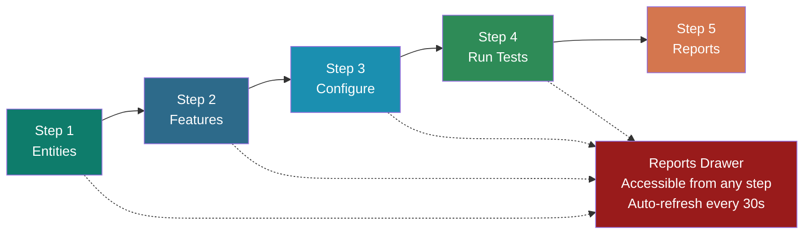
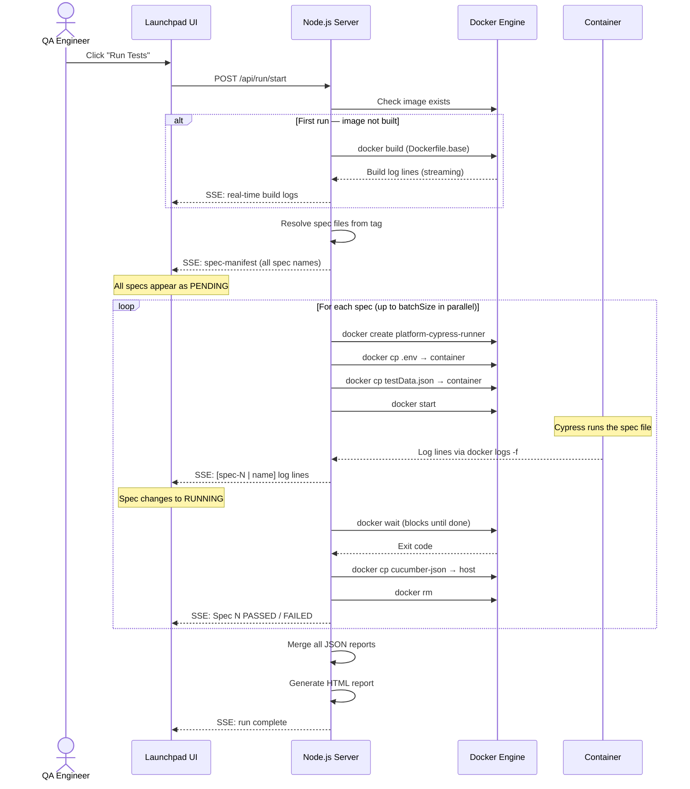
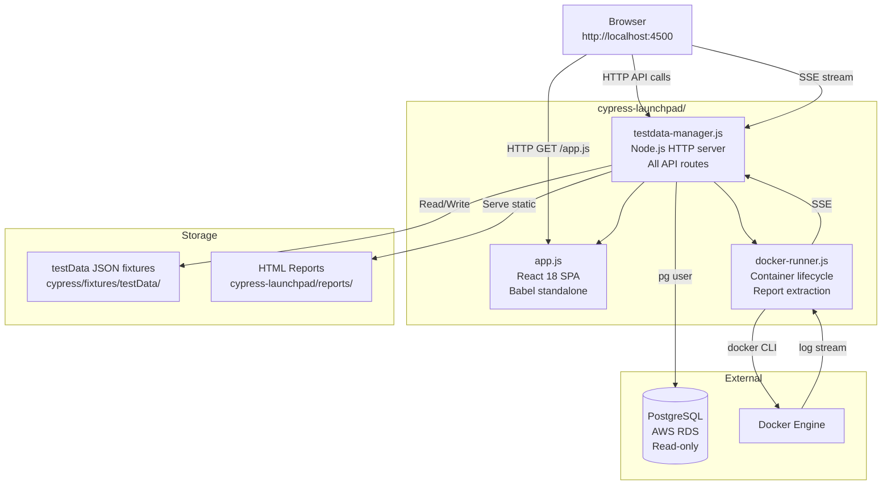

# Cypress Launchpad — Proof of Concept

**Version:** 1.2
**Last Updated:** 2026-04-17
**Maintained by:** SauceDemo QA Engineering Team

---

## Table of Contents

1. [What Is the Cypress Launchpad?](#1-what-is-the-cypress-launchpad)
2. [Problem Statement](#2-problem-statement)
3. [How It Solves Those Problems](#3-how-it-solves-those-problems)
4. [The 5-Step Workflow](#4-the-5-step-workflow)
5. [Step-by-Step Walkthrough](#5-step-by-step-walkthrough)
6. [Docker Execution Model](#6-docker-execution-model)
7. [Real-Time Monitoring](#7-real-time-monitoring)
8. [Reports](#8-reports)
9. [Technical Architecture](#9-technical-architecture)
10. [Platform Support](#10-platform-support)
11. [Technology Stack](#11-technology-stack)
12. [Getting Started](#12-getting-started)
13. [Design Decisions Log](#13-design-decisions-log)

---

## 1. What Is the Cypress Launchpad?

The **Cypress Launchpad** is a browser-based control panel for the SauceDemo test automation framework. It runs at `http://localhost:4500` and gives QA engineers a complete, guided interface to:

- Update test data fixtures without touching any file directly
- Choose which tests to run (by tag or by browsing feature files)
- Configure how tests run (local browser or Docker, batch size, browser choice)
- Watch tests execute with live streaming logs per container
- View and navigate past reports from any screen

**Before the Launchpad existed**, every one of these tasks required command-line knowledge, manual file editing, and knowing the exact structure of the project. Now a QA engineer can do all of it from a single browser tab in under two minutes.

---

## 2. Problem Statement

| Problem | Who Is Affected |
|---|---|
| Updating test entity names required manually editing JSON fixture files | All QA engineers |
| Running tests needed Cypress CLI knowledge and correct env setup | New / junior QA engineers |
| No way to know if an entity name is valid without checking the database separately | All QA engineers |
| Parallel Docker runs required writing shell scripts and managing containers by hand | Senior QA / DevOps |
| Live test output was only visible in a terminal — no way to share or monitor remotely | QA Leads |
| Reports were scattered in the filesystem with no central viewer | QA Leads / Managers |
| Running tests on Windows had path and Docker compatibility issues | Windows users |
| Selecting the wrong batch size caused OOM crashes on laptops with amex RAM | All Docker users |

---

## 3. How It Solves Those Problems

| Problem | Launchpad Solution |
|---|---|
| Manual JSON editing | Step 1 UI with form fields — save with one click |
| Entity name validation | Live autocomplete queries the actual PostgreSQL database |
| CLI knowledge required | 5-step guided workflow — no terminal needed |
| Container management | Docker runner handles full lifecycle automatically |
| Live output not shareable | SSE log streaming — any browser tab watching the run gets live logs |
| Reports scattered | Persistent Reports drawer — accessible from every step, auto-refreshes every 30s |
| Windows Docker issues | Cross-platform path quoting, BuildKit disabled, Windows-specific Docker handling |
| OOM crashes | Device capacity API reads free RAM and recommends safe batch size before you run |

---

## 4. The 5-Step Workflow

The Launchpad is structured as a linear 5-step wizard. Each step has a single, clear purpose.



The **Reports drawer** (top-right header button) is always visible regardless of which step you are on. You never need to navigate to Step 5 just to check a past report.

---

## 5. Step-by-Step Walkthrough

### Step 1 — Entities

**Purpose:** Set the entity names that your tests will use (category names, variant names, user names, cart names). These are saved to `cypress/fixtures/testData/{env}TestData.json`.

**How it works:**

1. Select an environment from the dropdown (env1, env2, env3, env4, beta, alpha)
2. Click **Load Data** — the current fixture values populate the form
3. Type in any field to trigger live database autocomplete (minimum 2 characters)
4. Linked entity filtering automatically narrows dependent dropdowns:

```
Category selected
    └── Product options filtered to that category
            └── Variant options filtered to that product
                    └── User options filtered to that variant
                            └── Cart options filtered to that variant
```

5. Click **Save to TestData** — writes changes directly to the fixture file

**Why this matters:** Tests read entity names from the fixture file at runtime. If the name in the fixture does not match what is in the database, the test fails immediately. This step ensures the fixture always contains a real, valid entity name before any run begins.

---

### Step 2 — Features

**Purpose:** Select which tests to run.

Two modes:

| Mode | How It Works |
|---|---|
| **By Tag** | Type a tag (e.g. `@checkout`, `@smoke`, `@product`). The Launchpad counts all matching scenarios across all feature files and shows the exact list of specs that will run. |
| **By Spec File** | Browse the full feature file tree. Select individual `.feature` files. Tab key autocompletes paths stopping at folder boundaries. |

**Tag search example:**
```
Type: @checkout
Result: 12 spec files matched · 47 scenarios total
```

**Tab autocomplete example:**
```
Type: product/temp   → press Tab
Completes to: product/temporaryOrder/
Press Tab again → product/temporaryOrder/VISA/
```

---

### Step 3 — Configure

**Purpose:** Choose how tests will run.

#### Run Mode

| Mode | When to Use | What It Does |
|---|---|---|
| **Local** | Daily development, debugging | Uses Cypress + browser installed on your machine. Optionally headed (browser visible on screen). |
| **Docker** | Clean regression runs, parallel execution | Spins up isolated Linux containers. Same environment every time. Headless by default. |

#### Batch Size (Docker only)

Controls how many spec files run in parallel. Maximum is 2.

The Launchpad reads your device's available RAM via the `/api/device-capacity` endpoint and displays a recommendation:

```
Device Capacity
  Total RAM:    16 GB
  Free RAM:      9 GB
  Recommended:  Batch Size 2
```

A warning badge appears if you select a batch size higher than the recommendation.

#### Browser Selection

- **Local mode**: Detects all installed browsers automatically (Chrome, Firefox, Edge, Electron)
- **Docker mode**: Chrome, Firefox, or Edge (all pre-installed in the Docker base image)

---

### Step 4 — Run Tests

**Purpose:** Execute tests and observe them in real time.

Click **Run Tests** and the following happens immediately:

1. The sticky status bar at the top shows: `RUNNING | env3 | Docker · Chrome · Batch 2 | ⏱ 00:23`
2. A progress bar tracks how many specs are complete out of total
3. The **Spec Progress Tracker** appears with every spec listed:

| Status | Meaning |
|---|---|
| Pending | Queued — container not started yet |
| Running | Container is active, logs are streaming |
| Passed | Container exited with code 0 |
| Failed | Container exited with code 1 |

4. **Container Stats** show per-container CPU and memory usage with colour-coded progress bars (green → amber → red as usage climbs)

5. **Split Log Viewer** shows live logs from up to 2 active containers side by side. Each panel has:
   - **Copy button** — copies clean plain text (ANSI codes stripped automatically)
   - **Filter buttons** — All / Errors / Warnings
   - **Search box** — filter log lines across both panels in real time

6. When all specs finish, a **Completion Summary** banner appears showing total passed, total failed, and duration. Failed specs show the exact error line inline so you do not need to scroll through the full log.

---

### Step 5 — Reports

**Purpose:** Review full HTML test reports.

Each test run generates a timestamped HTML report at:
```
cypress-launchpad/reports/{YYYY-MM-DD_HH-MM}_{env}_{tag}/html/index.html
```

The Reports step (and the persistent Reports drawer) shows:
- All past reports listed by date, environment, and tag
- Pass/fail counts per report
- Per-scenario failure details with the failed step and error message
- Screenshots captured at the point of failure
- Option to delete old reports

---

## 6. Docker Execution Model

When you run in Docker mode, the Launchpad creates **one isolated container per spec file**. This is the core architectural decision.

### Why One Container Per Spec?

| Approach | Problem |
|---|---|
| One container for all specs | Parallel Cypress processes write to the same `cucumber-json/` folder — race condition corrupts results |
| One container per spec | Each container has its own isolated filesystem — no collisions, no workarounds |

### Full Lifecycle (per spec)



### Two-Layer Docker Image Design

To keep rebuilds fast, the Docker image is split into two layers:

| Image | What It Contains | When It Rebuilds |
|---|---|---|
| `platform-cypress-base` | MS Edge, Cypress system dependencies, `node_modules` | Only when `package.json` changes — rare |
| `platform-cypress-runner` | `COPY . .` — test files on top of base | On every "Rebuild Image" click — fast |

A normal rebuild takes **10-20 seconds** because it only copies changed test files. A full rebuild (with `npm install`) takes several minutes but is only needed after adding packages.

---

## 7. Real-Time Monitoring

All log output flows from the Docker container to your browser using **Server-Sent Events (SSE)** — a persistent HTTP connection where the server pushes data to the browser as it arrives.

```
Docker container
    → docker logs -f (streaming)
        → Node.js server reads lines
            → SSE push to browser
                → React state update
                    → LogLine render (ANSI colors parsed)
```

The browser never polls. Each log line arrives in under 100ms of being written inside the container.

### Log Display Features

| Feature | How It Works |
|---|---|
| Color coding | ANSI escape codes from Cypress output are parsed into colored spans |
| Error highlighting | Lines matching `Error:`, `AssertionError`, `✗` get a red background stripe and 3px red left border |
| Warning highlighting | Lines matching `warn`, `deprecated` get an orange background stripe |
| Filter: Errors | Shows only error lines across all containers |
| Filter: Warnings | Shows only warning lines |
| Search | Free-text filter applied across all containers simultaneously |
| Copy | Copies clean plain text — all ANSI escape codes stripped before clipboard write |
| Auto-scroll | Each panel scrolls to the latest line automatically while filter is set to "All" |

---

## 8. Reports

Each run produces a self-contained HTML report using `multiple-cucumber-html-reporter`. The report includes:

- Environment, browser, and run duration metadata
- Total scenario count with pass/fail breakdown
- Per-feature and per-scenario results
- Failed step with full error message
- Screenshot embedded at the point of failure

Reports are stored in `cypress-launchpad/reports/` and served statically by the Launchpad server. The Reports drawer in the header lists all past reports, auto-refreshes every 30 seconds, and lets you delete old runs to free disk space.

---

## 9. Technical Architecture



### File Breakdown

| File | Size | Responsibility |
|---|---|---|
| `testdata-manager.js` | ~1150 lines | HTTP server, all 20+ API routes, PostgreSQL queries, run orchestration |
| `app.js` | ~3000 lines | Complete React UI — all 5 steps, all components, all inline styles |
| `docker-runner.js` | ~520 lines | Docker image build, container create/start/wait/rm, report extraction, SSE |
| `Dockerfile.base` | ~180 lines | Base image with Edge, Cypress dependencies, pre-installed node_modules |

### API Routes (key)

| Endpoint | Purpose |
|---|---|
| `GET /api/envs` | List available environments |
| `GET /api/data?env=X` | Load fixture values for an environment |
| `POST /api/save` | Write entity names to fixture file |
| `GET /api/search?env=X&q=Z` | Live DB autocomplete |
| `GET /api/search-linked?...` | Linked entity autocomplete |
| `GET /api/tags` | All @tags with scenario counts |
| `GET /api/specs-by-tag?tag=X` | Spec files matching a tag |
| `GET /api/device-capacity` | Device RAM + recommended batch size |
| `GET /api/browsers` | Detected local browser installations |
| `POST /api/run/start` | Start a test run |
| `GET /api/run/logs/:runId` | SSE stream of live log output |
| `POST /api/run/stop/:runId` | Kill all active containers |
| `POST /api/docker/build` | Build Docker image (SSE progress) |
| `GET /api/reports` | List all past report directories |
| `GET /api/reports/:name/failures` | Failure summary for a report |

---

## 10. Platform Support

| Platform | Local Mode | Docker Mode | Notes |
|---|---|---|---|
| **Mac** | Full support | Full support | Standard path handling, `--memory=4g` per container |
| **Linux** | Full support | Full support | Prefer Docker Engine (`docker.io`) over Docker Desktop (QEMU OOM risk under parallel load) |
| **Windows** | Full support | Full support | Executable paths quoted, `exec()` used for Docker commands, `DOCKER_BUILDKIT=0` globally, no `--memory` flags (Docker Desktop manages dynamically) |

---

## 11. Technology Stack

| Layer | Technology | Why |
|---|---|---|
| Frontend | React 18 (CDN) + Babel standalone | No build step — serve a single JS file directly |
| Backend | Node.js `http` module | No Express dependency, lightweight, full control |
| Database | PostgreSQL via `pg` user | Direct read-only queries to environment DB |
| Containerisation | Docker CLI | Industry standard, cross-platform, no Kubernetes overhead needed |
| Log streaming | Server-Sent Events (SSE) | One-way server-to-browser push — simpler than WebSocket for log streaming |
| Test framework | Cypress 15.x + cucumber-preprocessor | Core test runner inside containers |
| Reporting | multiple-cucumber-html-reporter | Generates feature-level HTML reports from Cucumber JSON |

---

## 12. Getting Started

### Launch (with Cypress UI)

```bash
npm run env3
```

This starts both Cypress and the Launchpad simultaneously. Open `http://localhost:4500`.

### Launch (standalone, no Cypress)

```bash
node cypress-launchpad/testdata-manager.js
```

### Run Your First Test via the Launchpad

1. Open `http://localhost:4500`
2. **Step 1** — Select environment → Load Data → Verify entity names are correct → Save
3. **Step 2** — Select a tag (e.g. `@smoke`) to see matched specs
4. **Step 3** — Choose Local or Docker, select browser
5. **Step 4** — Click Run Tests → watch the logs
6. **Step 5** — View the HTML report

### Build Docker Image (first time only)

In Step 4, if the Docker image does not exist, a **Build Docker Image** button appears. Click it. Build takes 3-5 minutes on first run. Subsequent runs use the cached image and rebuild in under 20 seconds.

---

## 13. Design Decisions Log

This section records key architectural decisions made after the initial POC, with context and rationale.

---

### Decision: Stale Docker Image Detection

**Date:** 2026-04-15  
**Status:** Implemented

#### Context

When a QA engineer adds a new `.feature` file and immediately tries to run it in Docker mode, the Docker image does not contain the new file — it was built before the file was added. Cypress exits with "Can't run because no spec files were found". Previously this produced a confusing empty HTML report with no indication of the real cause.

#### Decision

Detect the stale image condition automatically by scanning each log line for the exact Cypress error string ("Can't run because" + "no spec files"). Set a `specNotFoundInImage` flag per container and a `staleImageDetected` flag per run. When detected:
- Emit three `⚠` warning log lines identifying the missing spec path and pointing the user to Configure step → Rebuild Image
- Skip HTML report generation entirely (an empty report is misleading)
- Still fire `onDone` so the UI reaches a completed state normally

#### Consequences

- Users see a clear actionable warning instead of an empty report
- No partial reports generated for stale runs
- The detection is passive (no extra Docker commands) — it reads log lines that are already being streamed

---

### Decision: Post-Run Action Bar (Run Again / Change Features / Change Environment)

**Date:** 2026-04-15  
**Status:** Implemented

#### Context

After a test run completed, the only way to re-run or change configuration was to manually navigate back through the step indicator. This required multiple clicks and occasionally left stale run state (logs, status) on previous steps.

#### Decision

Show a three-button action bar in `RunPanel` immediately when `runStatus` reaches `passed | failed | stopped`. Buttons call `resetRun(n)` which clears all run state before navigating. The same `resetRun` logic is applied to the back button and step indicator clicks when a completed run exists.

#### Consequences

- One-click restart from any completed state
- Clean navigation — stale logs never persist to previous steps
- `goBack()` and `onStepClick` now have branching logic (`runStatus ? resetRun(n) : setCurrentStep(n)`)

---

### Decision: Unified Report Folder for All Run Modes

**Date:** 2026-04-15  
**Status:** Implemented

#### Context

Docker runs wrote reports to `cypress-launchpad/reports/`. Local runs (local headed, local headless, debug) previously returned `reportDir: null` from `onDone`, so they never appeared in the Reports drawer.

#### Decision

Call `buildReportDir(env, tag, mode)` at the start of every run (Docker and local). The `mode` parameter appends a suffix to the folder name (`_docker`, `_local-headed`, `_local-headless`, `_debug`) so reports from different run modes are clearly distinguishable. For local runs, Cucumber JSON files are collected by `mtimeMs >= runStartTime` filter and copied into the report folder on process exit, then `generateHtmlReport` is called. Debug runs skip HTML generation (cypress open produces no JSON) but still create a folder and pass `reportDir` to `onDone`.

Both `buildReportDir` and `generateHtmlReport` are now exported from `docker-runner.js` so `testdata-manager.js` can call them directly.

#### Consequences

- All run modes appear in the Reports drawer automatically
- Report folders are self-documenting via the `_mode` suffix
- HTML report metadata (device label, platform, display mode) is now accurate per mode
- Debug sessions show in the drawer as an empty folder — no misleading HTML report

---

---

### Decision: cypress-cucumber-preprocessor v4.3.1 — Correct setupNodeEvents API

**Date:** 2026-04-17
**Status:** Implemented

#### Context

`cypress.config.js` previously called `require('cypress-cucumber-preprocessor/plugins')(on, config, options)` inside `setupNodeEvents`. This sub-path (`/plugins`) does not exist in `cypress-cucumber-preprocessor` v4.3.1. The call threw a `MODULE_NOT_FOUND` error at Cypress startup, preventing any test run from starting — in both local and Docker modes.

#### Decision

Use the correct v4.3.1 API:

```js
const cucumberPlugin = require('cypress-cucumber-preprocessor').default;

setupNodeEvents(on, config) {
  on('file:preprocessor', cucumberPlugin());
  return config;
}
```

`return config` is required — Cypress uses the return value of `setupNodeEvents` to pick up any modifications made inside the hook. Omitting it causes env vars and other config mutations to be silently dropped.

Additionally, the `cypress-cucumber-preprocessor` config block was added to `package.json` to enable Cucumber JSON output:

```json
"cypress-cucumber-preprocessor": {
  "cucumberJson": {
    "generate": true,
    "outputFolder": "cypress/cucumber-json",
    "filePrefix": "",
    "fileSuffix": ".cucumber"
  }
}
```

This drives the `outputFolder` that `testdata-manager.js` reads when collecting local-run result files for HTML report generation.

#### Consequences

- Cypress starts without errors in all run modes (local, Docker, debug)
- Cucumber JSON files are written to `cypress/cucumber-json/` after every local run
- The Launchpad's local-run report path (`testdata-manager.js`: scan `cypress/cucumber-json/` for `.json` files newer than `runStartTime`) works correctly
- No other files required changes — the fix is isolated to `cypress.config.js` and `package.json`

---

*For the full Docker architecture deep-dive including beginner-level explanations, see [readme-docs/launchpad-docker-architecture.md](readme-docs/launchpad-docker-architecture.md).*

*For system-wide flowcharts covering all components, see [FLOWCHART.md](FLOWCHART.md).*
