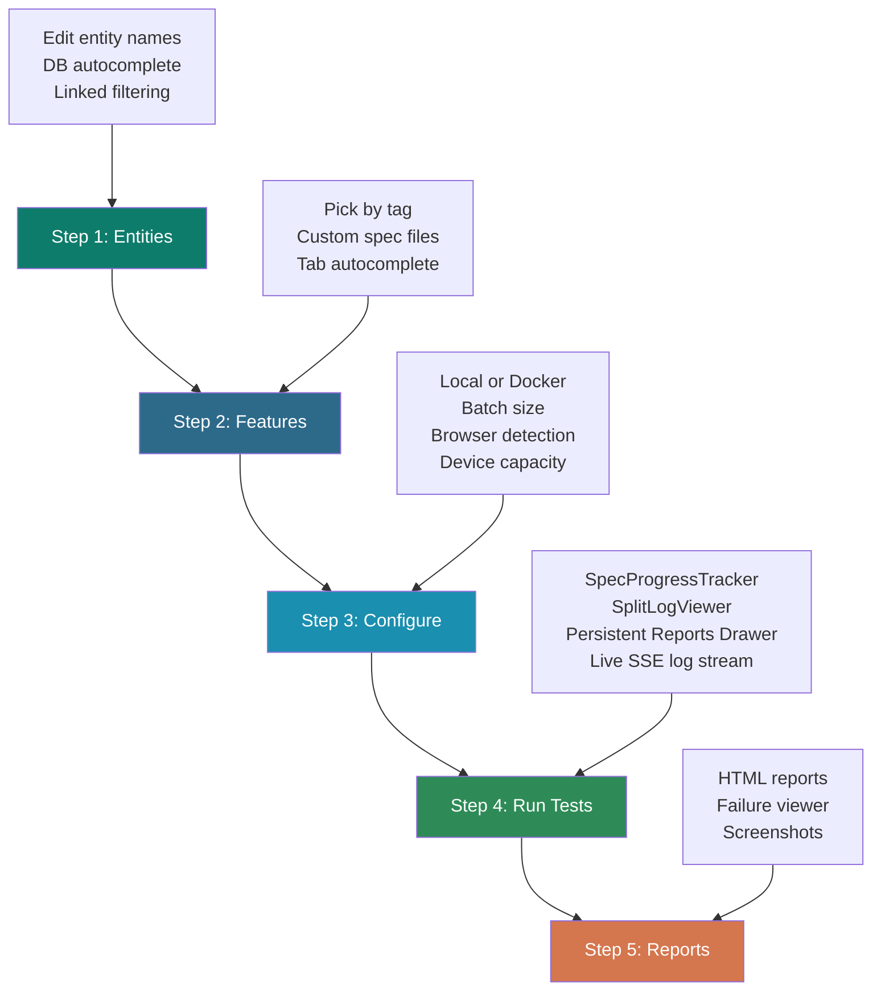

# Cypress Launchpad & Test Data Manager

[← AI Agents Guide](./ai-agents-guide.md) | [← Back to CLAUDE.md](../CLAUDE.md)

---

## Overview

The **Cypress Launchpad** (`cypress-launchpad/`) is the all-in-one web interface for test operations. It combines entity data management, test execution, and report viewing into a single 5-step workflow. It runs on **http://localhost:4500** and is automatically launched alongside Cypress whenever you run any environment command.

**What you can do with it:**
- Edit entity names in your `{env}TestData.json` fixtures with live database autocomplete
- Pick tests to run by tag or by browsing/searching feature files
- Configure run mode (local browser or Docker), batch size, and browser
- Watch tests run with real-time SSE log streaming
- Review HTML test reports and failure summaries

**Important**: The tool only modifies entity name fields in fixture files (e.g., category names, product names). It **never touches** product data, transaction records, Cypress config, or environment credentials.

---

## Quick Start

### Automatic Launch (with Cypress)

```bash
# Launch both Cypress UI and the Launchpad simultaneously
npm run env1
# Or: env2, env3, env4, beta, alpha
```

Both services start in parallel:
- **Cypress**: http://localhost:3000
- **Cypress Launchpad**: http://localhost:4500

### Standalone Launch

```bash
# Run the Launchpad independently
node cypress-launchpad/testdata-manager.js
```

Then open http://localhost:4500 in your browser.

---

## 5-Step Workflow



---

## Step 1 — Entities

Manage entity names in your `{env}TestData.json` fixture file.

### How to Use

1. Open **http://localhost:4500**
2. Select your environment from the dropdown (env1-5, beta, alpha)
3. Click **"Load Data"** to populate the UI with current fixture values
4. Edit entity name fields using the database autocomplete
5. Click **"Save to TestData"** to write changes to the fixture file

### Data Cards

The UI is organized into **5 data cards** with **2 tabs**: "Existing Entities" and "New Entities".

| Card | Purpose | Fields |
|------|---------|--------|
| **Payment Methods** | Non-staffing entities | Amex Companies, Mastercard Companies |
| **Direct Businesses** | Direct funding model | Categories, Products, Variants, Users |
| **Direct Carts** | Direct model workers | Mastercard, Amex, Paypal, VISA |
| **Indirect Businesses** | Indirect funding model | Categories, Products, Variants, Users |
| **Indirect Carts** | Indirect model workers | Mastercard, Amex, Paypal, VISA |

### Database Autocomplete

Start typing in any field (minimum 2 characters) to trigger live autocomplete from your environment's PostgreSQL database.

```
Type: "acm"
  Autocomplete queries live database
  Shows: "Acme Inc", "Acme Ltd", "Acme Staffing"
  Click to select
```

### Linked Entity Filtering

Selecting a parent entity automatically filters dependent autocomplete lists:

```
Category (standalone)
    linked via product_set
Product (filtered to category)
    linked via platform.service (product-variant)
Variant (filtered to product)
    linked via platform.service (user-variant)
User (filtered to variant)
    linked via swag.product
Carts (filtered to variant)
```

---

## Step 2 — Features

Choose which tests to run. Two modes are available:

- **By Tag**: Search for a Cypress tag (e.g., `@checkout`, `@smoke`). The Launchpad counts all matching scenarios (including Scenario Outline rows) and shows spec files that will run.
- **By Spec Files**: Browse the feature file tree and select individual files. Use **Tab** to autocomplete a typed path — autocomplete stops at folder boundaries so you can navigate directory by directory.

### Tab Autocomplete for Feature Search

Press **Tab** while typing in the feature file search box to auto-complete:

```
Type: "product/temp"
  Press Tab
  Completes to: "product/temporaryOrder/"
  Press Tab again to go deeper
```

---

## Step 3 — Configure

Set how tests will run.

### Run Modes

| Mode | When to Use | Notes |
|------|------------|-------|
| **Local** | Daily development and debugging | Uses your local Cypress + browser install |
| **Docker** | Clean CI-like runs, parallel batches | Requires Docker Desktop to be running |

### Device Capacity Detection (Docker mode)

When Docker mode is selected, the Launchpad fetches your device's memory information from `/api/device-capacity` and displays it in the Configure step:

```
Device Capacity
  Total RAM:    16 GB
  Free RAM:      8 GB
  Recommended:  Batch Size 2
```

**Recommendation logic:**

| Free RAM | Recommended Batch Size |
|----------|------------------------|
| > 8 GB   | 2 |
| <= 8 GB  | 1 |

The maximum batch size is **2**. A warning is shown if your selected batch size exceeds the recommended value based on free RAM. This prevents OOM crashes, especially on 14 GB Windows laptops.

### Browser Detection

The Launchpad detects locally installed browsers via `/api/browsers`. On Windows, it checks standard installation paths before falling back to `PATH`:

- `C:\Program Files\Google\Chrome\Application\chrome.exe`
- `C:\Program Files (x86)\Microsoft\Edge\Application\msedge.exe`
- Standard Firefox paths

Detected browsers appear in the browser selector dropdown automatically.

### Entity Data Set Mode

The Direct/Indirect/Both selector has been removed from this step. Feature files already contain both scenario types by design. All runs default to `both` — no configuration required.

---

## Step 4 — Run Tests

### SpecProgressTracker

A **SpecProgressTracker** panel appears at the top of Step 4. It shows every spec that will run, with a live status indicator for each:

| Status | Meaning |
|--------|---------|
| Pending | Queued, container not started yet |
| Running | Container is active, logs streaming |
| Passed | Container exited with code 0 |
| Failed | Container exited with a non-zero code |

The panel has a **pinned header** showing total / running / pending / done counts, and the spec list scrolls independently (200px height). Spec names are broadcast upfront from docker-runner so all specs appear as `Pending` before the first container even starts — you always have a complete picture of the run.

### Persistent Reports Drawer

A **Reports** button is pinned in the header and accessible from any step. Click it to open the reports drawer without navigating away from the current step. The drawer auto-refreshes every 30 seconds. You no longer need to complete a run and navigate to Step 5 to check historical reports.

### SplitLogViewer

Log output is shown in the `SplitLogViewer`. Layout is controlled by batch size:

- **Batch size 1**: Single full-width log panel
- **Batch size 2**: Two panels side-by-side, one per active container

The viewer always shows the last 2 active panels so completed spec logs stay visible even as new containers start. Panels use 1-based numbering (Spec 1, Spec 2). An empty panel shows "Starting container..." as a placeholder until log lines arrive.

### Local Mode

Tests run using your local Cypress install with the selected browser. Logs stream to the UI in real time via SSE (Server-Sent Events). ANSI color codes from Cypress output are rendered correctly in the log viewer.

### Docker Mode

Tests run inside a `platform-cypress-runner` Docker container. The full lifecycle is:

```
Pull base image
  Build image (real-time log streaming to UI)
  Create container
  Copy .env + testdata fixtures + temp scripts into container
  Start container
  Stream logs via SSE
  Wait for completion
  Copy reports out of container
  Remove container
```

**Real-time build logs**: Docker image builds stream output line-by-line to the UI. You can watch layer downloads and build steps as they happen.

### Platform-Specific Docker Behavior

| Platform | Memory Allocation | Path Handling | BuildKit |
|----------|------------------|---------------|----------|
| **Windows** | None (Docker Desktop manages) | Executable path quoted if spaces present | Disabled globally |
| **Linux / Mac** | `--memory=batchSize*4g` | Standard Unix | Disabled globally |

BuildKit is disabled globally (`DOCKER_BUILDKIT=0`) on all platforms to avoid Windows credential helper issues.

**Want to understand Docker architecture in detail?** See **[Launchpad Docker Architecture](./launchpad-docker-architecture.md)** — explains how Docker works internally for beginners (1 year exp), intermediates (5-10 years), and advanced engineers (15+ years).

---

## Step 5 — Reports

After a run completes, the Reports step lists all saved HTML reports. You can:

- Open a full HTML report in the browser
- View a failure summary (failing scenario names and error messages)
- Delete old reports to free disk space

Reports are saved to `cypress-launchpad/reports/{date}_{env}_{tag}/html/`.

---

## Data Flow

```
User edits entity fields in Step 1
    Clicks "Save to TestData"
    Tool writes to cypress/fixtures/testData/{env}TestData.json
    Cypress tests run (Step 4)
    Step definitions read from fixture
    Tests use entity names in API calls and assertions
```

---

## Supported Environments

| Environment | Database Region |
|-------------|----------------|
| env1 | AWS ap-south-1 (Mumbai) |
| env2 | AWS ap-south-1 (Mumbai) |
| env3 | AWS ap-south-1 (Mumbai) |
| env4 | AWS ap-south-1 (Mumbai) |
| env5 | AWS ap-south-1 (Mumbai) |
| beta | AWS eu-west-2 (London) |
| alpha | AWS eu-west-2 (London) |

Database connections use **port 5980** with SSL enabled and read-only credentials.

---

## Entity Fields Reference

### Payment Methods Card
```json
{
  "paymentMethods": {
    "amexCards": "Amex Co Name",
    "mastercards": "Mastercard Co Name"
  }
}
```

### Direct/Indirect Businesses and Carts Cards
```json
{
  "direct": {
    "businesses": {
      "categories": "Category Name",
      "products": "Product Name",
      "variants": "Variant Name",
      "users": "User Name"
    },
    "carts": {
      "mastercard": "Mastercard Cart Name",
      "amex": "Amex Cart Name",
      "paypal": "Paypal Cart Name",
      "visa": "VISA Cart Name"
    }
  },
  "indirect": {
    "businesses": { /* same structure */ },
    "carts": { /* same structure */ }
  }
}
```

---

## UI Layout Reference

```
+-------------------------------------------------------------+
|  Cypress Launchpad                              [?] [X]     |
+-------------------------------------------------------------+
|  [1 Entities]  [2 Features]  [3 Configure]  [4 Run]  [5 Reports] |
+-------------------------------------------------------------+
|                                                             |
|  Environment: [env3 v]  [Load Data]                    |
|                                                             |
|  Tabs: [Existing Entities]  [New Entities]                 |
|                                                             |
|  +-----------------------------------------------------------+
|  | Payment Methods                                        |
|  | Amex Company:  [Input with autocomplete          ]   |
|  | Mastercard Company: [Input with autocomplete          ]   |
|  +-----------------------------------------------------------+
|                                                             |
|  +-----------------------------------------------------------+
|  | Direct · Businesses                                      |
|  | Categories: [Input with autocomplete          ]          |
|  | Products:   [Input with autocomplete (filtered)]         |
|  | Variants:  [Input with autocomplete (filtered)]         |
|  | Users:   [Input with autocomplete (filtered)]         |
|  +-----------------------------------------------------------+
|                                                             |
|  [... more cards ...]                                      |
|                                                             |
|  [Save to TestData]                                        |
+-------------------------------------------------------------+
```

---

## Troubleshooting

### Issue: "Failed to load data from database"

**Cause**: Database credentials for the selected environment are incorrect or database is unreachable.

**Solution**:
1. Verify environment is set: check `.env` file contains `API_URL`
2. Confirm database is accessible from your network
3. Try a different environment (e.g., switch from env3 to env1)

### Issue: Autocomplete shows no results

**Cause**: Entity does not exist in the database or search term does not match.

**Solution**:
1. Check spelling — autocomplete is case-insensitive but requires matching substrings
2. Ensure the entity is active and not deleted in the database
3. Try a shorter search term (e.g., "ABC" instead of "ABC Staffing Ltd")
4. Verify you are on the correct environment

### Issue: Changes saved but not appearing in Cypress tests

**Cause**: Cypress cached an old fixture or is reading from the wrong environment.

**Solution**:
1. Clear Cypress cache: `npx cypress cache clear`
2. Verify Cypress is using the correct environment: check `.env`
3. Confirm the fixture file timestamp is recent
4. Restart Cypress: close and reopen with `npm run env3`

### Issue: Docker build is silent or hangs

**Cause**: Pre-2026-04-01 behavior — Docker builds previously produced no output during build.

**Solution**: Update to the latest Launchpad version. Build logs now stream in real time to the Configure step UI while the image is being built.

### Issue: Docker fails on Windows with path errors

**Cause**: Docker executable is installed in a path containing spaces (e.g., `C:\Program Files\Docker\...`).

**Solution**: This is fixed in the 2026-04-01 update. The Launchpad now wraps the Docker executable path in double quotes automatically. Ensure you are on the latest version.

### Issue: OOM crash when running multiple parallel tests on Windows

**Cause**: Batch size set too high for available RAM.

**Solution**: Use the device capacity display in Step 3 (Configure) to check recommended batch size. On a 14 GB Windows laptop, batch size 2 is safe. Reduce batch size if you see memory warnings in the UI.

### Issue: "Port 4500 already in use"

**Cause**: Launchpad is already running or another process is using port 4500.

**Solution**:
```bash
# Find the process using port 4500
lsof -i :4500               # macOS/Linux
netstat -ano | findstr 4500 # Windows

# Kill the process
kill -9 <PID>               # macOS/Linux
taskkill /PID <PID> /F      # Windows

# Then restart
node cypress-launchpad/testdata-manager.js
```

---

## Best Practices

### DO's

- Run "Load Data" at the start of each test session to refresh entity names from fixtures
- Verify linked entities (category → product → variant → user) are selected in order
- Use the device capacity indicator to choose a safe Docker batch size
- Use Tab autocomplete in Step 2 to navigate large feature file trees quickly
- Keep `{env}TestData.json` files version-controlled

### DON'Ts

- Do not manually edit `{env}TestData.json` files if using the Launchpad
- Do not save entity names that do not exist in the target environment database
- Do not expect the Launchpad to modify products, transactions, or Cypress configuration
- Do not assume batch size 3 is available — the maximum is 2 on all platforms
- Do not forget to click "Save to TestData" after making entity changes

---

## Integration with Cypress Tests

### Reading from Fixture

```javascript
// In cypress/e2e/step_definitions/
import testData from '@cypress/fixtures/testData/env3TestData.json'

Then('I create a new variant using the configured category', () => {
  const providerName = testData.direct.businesses.categories
  cy.log(`Creating variant for category: ${providerName}`)
  // ... test steps using providerName
})
```

### Data Validation Pattern

```javascript
When('I create a new cart', () => {
  const cartName = testData.direct.carts.mastercard
  cy.createCart(cartName)

  cy.task('connectDB', query.query_cart_by_name(cartName))
    .then((result) => {
      expect(result[0].name).to.equal(cartName)
    })
})
```

---

## Files Modified by the Launchpad

The tool writes only to:
```
cypress/fixtures/testData/{env}TestData.json
cypress-launchpad/reports/{date}_{env}_{tag}/html/    (test reports)
```

It **never modifies**:
- `.env` or environment configuration
- Feature files or step definitions
- Page objects or custom commands
- `cypress.config.js` or any other protected configuration
- Database data (read-only connection)

---

## Architecture Reference

| File | Purpose |
|------|---------|
| `cypress-launchpad/testdata-manager.js` | HTTP server (~port 4500), all API routes, DB queries, test execution |
| `cypress-launchpad/app.js` | React UI (Babel standalone, no build step) — all 5 steps |
| `cypress-launchpad/docker-runner.js` | Docker image build, container lifecycle, report extraction |
| `cypress-launchpad/reports/` | Generated HTML test reports |

For full technical details (API routes, state variables, component map), see `cypress-launchpad/CLAUDE.md`.

---

## Related Documentation

- **[Running Tests](./running-tests.md)** - How environments and Cypress UI work together
- **[Project Structure](./project-structure.md)** - Where fixture files are stored
- **[Architecture Overview](./architecture.md)** - How fixtures integrate with test execution
- **CLAUDE.md** - Data management patterns and database integration
- **cypress-launchpad/CLAUDE.md** - Technical reference for the Launchpad itself

---

**Last Updated**: 2026-04-09
**Maintained By**: Ajay Chandru (achandru@saucedemo.com)
